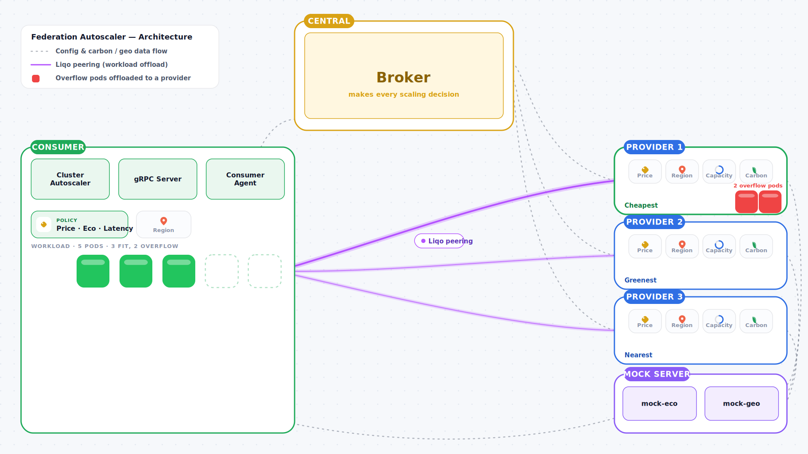

# Kubernetes Federation Autoscaler

The **Kubernetes Federation Autoscaler** defines a set of components and protocols that allow a Kubernetes _consumer_ cluster to acquire compute capacity from one or more existing Kubernetes _provider_ clusters running in arbitrary locations (cloud, edge, and on-premise) through a _broker_ that acts as an intermediary.

This project leverages the vanilla [Kubernetes Cluster Autoscaler](https://github.com/kubernetes/autoscaler) installed in the _consumer_ cluster, which intercepts an unsatisfied demand of resources and, instead of enlarging the cluster by adding one or more traditional nodes (e.g., VMs) to the cluster itself, it adds a virtual node that maps remote computing resources through [Liqo](https://liqo.io).
Hence, this allows the consumer cluser to borrow compute capacity from multiple existing Kubernetes clusters across heterogeneous providers.

The business logic is triggered by a set of policies in the _consumer_ cluster (e.g., prefer _cheapest_/_greenest_/_lowest latency_/etc provider clusters), which is applied by a _broker_ that knows all the available providers and determines the best one based on the consumer policies.
Then it returns the proper parameters to both consumer and provider clusters in order to start a Liqo peering relationship, which allow the consumer cluster to acquire (and consume) the negotiated provider resources.

<!-- Replace the placeholders once CI / releases exist -->
<!--  -->
<!--  -->
<!--  -->

---

## What it does

- Runs vanilla **Kubernetes Cluster Autoscaler** on the consumer cluster — no CA source-code changes.
- A small **gRPC Server** implements CA's `externalgrpc` contract and asks a local **Consumer Agent** for node groups and reservations.
- The **Consumer Agent** (on consumer clusters) and the **Provider Agent** (on provider clusters) talk — **agent-initiated only, over mTLS** — to a central **Resource Broker** that decides which provider cluster should donate capacity.
- **Liqo** then peers the two clusters and exposes the remote capacity as virtual nodes that CA (and the scheduler) treat like any other Node.

Works from NATed / firewalled clusters: only the Broker needs a public endpoint; consumers and providers need outbound egress only.

---

## Architecture at a glance



Full design, CRDs, API contracts, and execution flows: **[docs/design.md](docs/design.md)** (as-built — every section has an `Implemented in:` footer pointing at the canonical Go package).

---

## Required components
- A vanilla K8s cluster acting as consumer
- A set of one or more vanilla K8s clusters acting as providers
- The vanilla Kubernetes Cluster Autoscaler installed in the consumer cluster
- The Consumer installed in the consumer cluster
- The Provider installed in the consumer cluster
- Liqo installed in all clusters
- The Kubernetes Federation Broker running somewhere as a separated K8s cluster
- Mock servers running on a separated K8s cluster (or a simple machine) in case the policies are used

---

## Repository layout

```
federation-autoscaler/
├── api/            # CRD Go types (multi-group kubebuilder layout)
├── cmd/            # broker, agent, grpc-server, mock-eco, mock-geo entrypoints
├── config/         # kustomize overlays (broker, agent/{base,consumer,provider}, grpc-server, mock-eco, mock-geo, default meta)
├── deploy/
│   └── ansible/    # 4-host k3s demo install: playbooks, roles, demo-up.sh, burst-workload sample
├── docs/           # design.md (as-built), diagrams/
├── hack/           # development scripts
├── internal/       # controllers, broker REST API, agent core, gRPC server
├── test/
│   ├── e2e/        # multi-cluster e2e suite (kind/, bootstrap/, scenario/) — build tag `e2e`
│   └── utils/
├── Dockerfile      # multi-stage, parametrised by COMPONENT=; agent image bundles liqoctl
├── Makefile        # component-driven (COMPONENT=broker|agent|grpc-server|mock-eco|mock-geo)
└── PROJECT         # kubebuilder metadata
```

---

## Quick start

You need FOUR Ubuntu 22.04/24.04 VMs on the same network — 1 central, 1 consumer, 2 providers (add one more VM via `--mocks` for the eco/latency strategies). Then, from a control host:

```bash
# Bring up the whole demo in one command — installs tooling, then k3s,
# cert-manager, Liqo, broker, agents, grpc-server and Cluster Autoscaler
# on every VM:
curl -fsSL https://raw.githubusercontent.com/netgroup-polito/federation-autoscaler/main/deploy/ansible/scripts/demo-up.sh -o demo-up.sh
chmod +x demo-up.sh
./demo-up.sh --central <ip> --consumers <ip> --providers <ip>,<ip>
#   add --tag v0.X.Y to deploy a specific image tag (default: repo's fa_tag)
#   add --mocks <ip>  to stand up the mock cluster the eco/latency strategies need
```

### Dashboards

The demo ships four browser UIs — all plain HTTP:

| Dashboard | URL | What it shows / does |
| --- | --- | --- |
| **Broker dashboard** | `http://<central-ip>:30444/` | Read-only live federation state: provider advertisements (with cost, carbon, region), reservations, the instruction phase machine, chunk capacity, registered consumers. |
| **Liqo dashboard** | `http://liqo-dashboard.local` | Liqo peerings, virtual nodes, offloaded pods (Traefik Ingress on the consumer — add `<consumer-ip> liqo-dashboard.local` to your hosts file). |
| **Consumer console** | `http://<consumer-ip>:30445/` | Set the placement policy (No policy / Price / Eco / Latency) and region; apply/delete the demo workload. |
| **Provider console** | `http://<provider-ip>:30445/` | Set this provider's unit prices, region, and advertised CPU/RAM %. |

> The consumer/provider consoles are unauthenticated **and** write cluster state — keep them on a trusted network (demo-grade).

**Drive the scenarios from the browser** (no `kubectl` needed):

1. On each **provider console**, set its unit prices and region, then Apply (e.g. p1 cheapest + NSW, p2 greener + QC, p3 closest + IDF).
2. On the **consumer console**, set the region (e.g. ENG) and pick a policy → Apply.
3. Flip the **workload** switch **ON** and watch the **broker dashboard**: the chosen provider grows and a reservation appears — **Price → cheapest**, **Eco → greenest**, **Latency → closest**. Switch the policy and re-toggle the workload to compare.
4. Flip the **workload** switch **OFF** to scale back down.

The same scale up / down can be driven from the CLI instead:

```bash
# Scale UP — replicas that don't fit on the consumer's own node spill onto borrowed virtual nodes:
kubectl --kubeconfig ~/.kube/consumer-1.yaml apply  -f ~/federation-autoscaler/deploy/ansible/samples/burst-workload.yaml
# Scale DOWN — Cluster Autoscaler releases the borrowed nodes:
kubectl --kubeconfig ~/.kube/consumer-1.yaml delete -f ~/federation-autoscaler/deploy/ansible/samples/burst-workload.yaml
```

For the detailed setup — hardware and network requirements, the playbook-by-playbook manual install, tuning variables, troubleshooting — see **[deploy/ansible/README.md](deploy/ansible/README.md)**.

---

## Documentation

- **[deploy/ansible/README.md](deploy/ansible/README.md)** — install + demo guide (hardware/network requirements, the four playbooks step by step, running the demo, troubleshooting).
- **[docs/design.md](docs/design.md)** — full architectural proposal (v3.2, as-built) with `Implemented in:` footers.
- **[docs/diagrams/](docs/diagrams/)** — Mermaid sources + PNG renderings of the architecture / registration / scale-up / scale-down flows.

---

## Contributing

Issues and pull requests are welcome. We follow the standard *fork → branch → PR* workflow. Please run `make fmt lint test` before opening a pull request.

---

## References

- S. Galantino, R. Medina, A. Oliva, F. Risso, and G.  Frattini. "_Dynamic Multi-Provider Cluster Autoscaling For The Computing Continuum,_" in Proceedings of the 3rd International Workshop on Middleware for the Computing Continuum (Mid4CC '25), Nashville (TN), USA, December 2025, Association for Computing Machinery, New York, NY, USA, pages 1–6. https://doi.org/10.1145/3774898.3778037.
- K. Bigdeli, "_Kubernetes Federation Autoscaler Demo_", July 2026, https://www.youtube.com/watch?v=8KfzRoJ84qE.

---

## License

[Apache License 2.0](LICENSE) — kubebuilder default.
