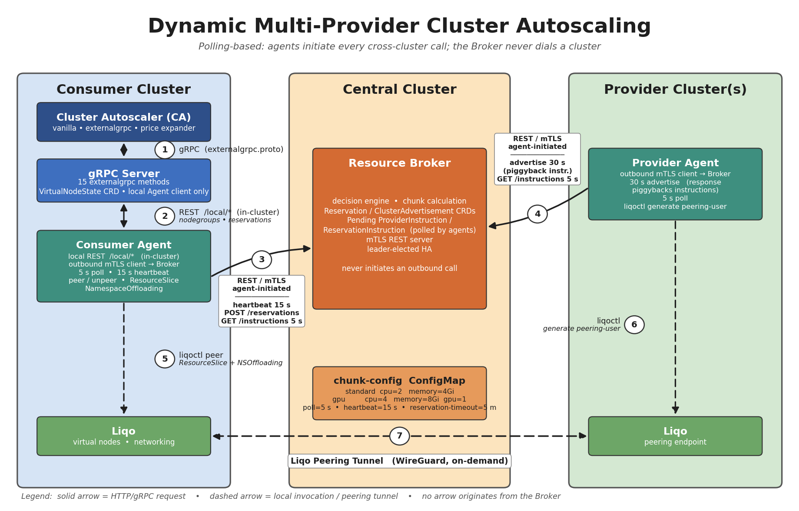

# federation-autoscaler

**A Kubernetes Cluster Autoscaler extension that dynamically borrows compute capacity from multiple existing Kubernetes clusters across heterogeneous providers — cloud, edge, and on-premise — and exposes them to the local scheduler as virtual nodes via Liqo.**

<!-- Replace the placeholders once CI / releases exist -->
<!--  -->
<!--  -->
<!--  -->

---

## What it does

- Runs vanilla **Kubernetes Cluster Autoscaler** on the consumer cluster — no CA source-code changes.
- A small **gRPC Server** implements CA's `externalgrpc` contract and asks a local **Consumer Agent** for node groups and reservations.
- The **Consumer Agent** (on consumer clusters) and the **Provider Agent** (on provider clusters) talk — **agent-initiated only, over mTLS** — to a central **Resource Broker** that decides which provider cluster should donate capacity.
- **Liqo** then peers the two clusters and exposes the remote capacity as virtual nodes that CA (and the scheduler) treat like any other Node.

Works from NATed / firewalled clusters: only the Broker needs a public endpoint; consumers and providers need outbound egress only.

---

## Architecture at a glance



| Channel | Initiator | Transport |
| --- | --- | --- |
| CA ↔ gRPC Server | CA | gRPC, in-cluster |
| gRPC Server ↔ Consumer Agent | gRPC Server | HTTP, in-cluster |
| Consumer Agent ↔ Broker | **Consumer Agent only** | HTTPS + mTLS — 5 s polling + synchronous POSTs (heartbeat, reservations) |
| Provider Agent ↔ Broker | **Provider Agent only** | HTTPS + mTLS — 5 s polling + synchronous POSTs (advertisements every 30 s) |
| Broker → any Agent | *never happens* | — |

Full design, CRDs, API contracts, and execution flows: **[docs/design.md](docs/design.md)**.

---

## Repository layout

```
federation-autoscaler/
├── api/            # CRD Go types (multi-group kubebuilder layout)
├── cmd/            # manager entrypoint(s)
├── config/         # kustomize manifests (CRDs, RBAC, Deployment)
├── internal/       # controllers and internal packages
├── docs/           # design doc + diagrams
├── hack/           # development scripts
├── test/           # e2e and envtest helpers
├── Dockerfile
├── Makefile
└── PROJECT         # kubebuilder metadata
```

---

## Quick start

Nothing is deployable yet — the project is at the scaffolding stage.

```bash
git clone https://github.com/netgroup-polito/federation-autoscaler
cd federation-autoscaler
make build         # compiles the manager binary
make test          # unit tests (envtest)
```

Installation instructions (`helm` chart and a kind-based demo) will land later in `docs/install.md`.

---

## Documentation

- **[docs/design.md](docs/design.md)** — full architectural proposal (v3)
- **[docs/diagrams/](docs/diagrams/)** — architecture, scale-up, scale-down diagrams

---

## Contributing

Issues and pull requests are welcome. We follow the standard *fork → branch → PR* workflow. Please run `make fmt lint test` before opening a pull request.

---

## Reference

Based on the paper *"Dynamic Multi-Provider Cluster Autoscaling For The Computing Continuum"*, ACM SAC 2025.

---

## License

[Apache License 2.0](LICENSE) — kubebuilder default.
