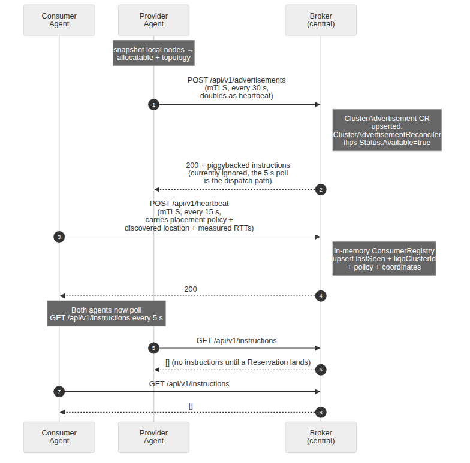

# Dynamic Multi-Provider Cluster Autoscaling for the Computing Continuum

## Architecture Overview (as-built)

**Version:** 4.0

**Status:** alpha. The design has shipped end to end across the broker, the agents, the gRPC server, and the four-cluster e2e suite. Numbered sections carry an "Implemented in:" footer pointing at the Go packages, kustomize overlays, or samples that realise them.

**Based on:** "Dynamic Multi-Provider Cluster Autoscaling For The Computing Continuum" (Mid4CC '25)

**Integrates:** k8s-resource-brokering, Multi-Cluster-Autoscaler, Kubernetes Cluster Autoscaler, Liqo

**How to read this document.** Sections 1 to 3 explain what the system does and how it is shaped, in plain language, no Kubernetes expertise required. Section 4 onward is the technical reference: components, custom resources, configuration, APIs, flows, and security. If you only want to understand the project, stop after section 3. If you are changing code, the code itself is authoritative; this document gives you the map and the invariants.

---

## Table of Contents

1. [What This System Does](#1-what-this-system-does)
2. [Goals and Non-Goals](#2-goals-and-non-goals)
3. [The Big Picture](#3-the-big-picture)
4. [Components](#4-components)
5. [Manual Reservations and Migration](#5-manual-reservations-and-migration)
6. [Custom Resources](#6-custom-resources)
7. [Configuration](#7-configuration)
8. [API Reference](#8-api-reference)
9. [Execution Flows](#9-execution-flows)
10. [Security](#10-security)
11. [Origins and Known Gaps](#11-origins-and-known-gaps)

---

## 1. What This System Does

A Kubernetes cluster is a group of machines that runs applications. When the cluster runs out of room, a standard component called the Cluster Autoscaler normally asks a cloud provider for more machines. That works for exactly one provider at a time, and only where new machines can be bought.

This project lets a cluster grow differently: instead of buying machines, it **borrows spare capacity from other, already-existing clusters**. One cluster (the **consumer**) can borrow from several others (the **providers**), which may belong to different organisations, run in different countries, or sit behind firewalls. A small central service (the **Broker**) keeps a live catalogue of who has spare capacity and matches borrowers to lenders.

Borrowed capacity appears inside the consumer cluster as an ordinary-looking extra machine (a **virtual node**, built by the open-source [Liqo](https://liqo.io) project). The standard Cluster Autoscaler runs completely unmodified: it sees "node groups" it can grow and shrink, asks for a node when applications are waiting, and gives it back when the load drops. All the federation machinery, brokering, choosing a provider, connecting the clusters, sits behind that interface.

The Broker can also choose **which** provider to borrow from according to a policy the consumer picks: the cheapest one, the one whose electricity grid is greenest, the one with the lowest measured network latency, or a default blend of free capacity and renewable energy. Operators can also reserve capacity manually, and the system will later **migrate** a manual reservation to a better provider if prices or conditions change.

---

## 2. Goals and Non-Goals

### Goals

- **G1:** One consumer cluster scales across multiple provider clusters simultaneously.
- **G2:** The Kubernetes Cluster Autoscaler runs with zero source modifications, driven through its standard `externalgrpc` cloud-provider interface.
- **G3:** Placement decisions are centralised in the Broker, which ranks providers by price, carbon intensity, measured latency, or a default blend of free capacity and renewable energy, per consumer.
- **G4:** Standard (CPU/memory) and GPU capacity are both supported, as separate chunk types.
- **G5:** Liqo provides peering and virtual nodes; capacity is shared in fixed-size chunks so multiple consumers can borrow from one provider.
- **G6:** Failures are handled with timeouts, staleness checks, idempotent instructions, and garbage collection.
- **G7:** All cross-cluster traffic is mutually authenticated (mTLS).
- **G8:** **Agent-initiated communication only.** The Broker never opens a connection toward a consumer or provider cluster. Every byte that reaches an agent is the response body of an HTTP call the agent made. Clusters behind NAT or firewalls can participate; only the Broker needs a reachable endpoint.
- **G9:** The gRPC server never talks to the Broker. It delegates every cross-cluster interaction to its co-located Consumer Agent over a cluster-local REST API and holds no Broker credentials.

### Non-Goals

- Provisioning new virtual or physical machines. The system only borrows from clusters that already exist.
- A cluster acting as consumer and provider at the same time. One role per cluster.
- Making the Cluster Autoscaler metric-aware. All price/carbon/latency logic lives in the Broker (and, for measured latency, the Consumer Agent). CA runs a neutral expander and never sees a metric.
- Cross-metric scoring. Each opt-in policy ranks on a single metric (price, carbon, or latency). The default Standard policy blends free capacity with a renewable-energy flag, but no policy combines price with carbon with latency into one score.
- Fast scale-up. A cold scale-up takes on the order of **two minutes**, dominated by Liqo peering (see §9.2). Re-using an existing peering takes seconds.
- Broker-initiated (push) delivery of any kind.

---

## 3. The Big Picture


> **Source-of-truth diagram:** [`diagrams/architecture.mmd`](diagrams/architecture.mmd). The PNG is a rendering; regenerate via `mmdc` per [`diagrams/README.md`](diagrams/README.md).

Three kinds of cluster take part, plus an optional fourth for demo mock services:

- The **central cluster** runs the **Broker**: a stateless HTTPS API in front of a set of Kubernetes custom resources (the durable record of advertisements, reservations, and pending work). It also serves a read-only web dashboard.
- Each **consumer cluster** runs the unmodified **Cluster Autoscaler**, the **gRPC server** (which implements CA's cloud-provider contract), the **Consumer Agent** (the only component that talks to the Broker), and Liqo.
- Each **provider cluster** runs the **Provider Agent** (its only contact with the Broker) and Liqo.
- An optional **mock cluster** hosts two small stand-in services, mock-geo (location by IP) and mock-eco (grid carbon intensity by region), which feed the eco and latency policies during demos.

<a id="asymmetric-model"></a>
**The one communication rule.** Everything is **agent-initiated**. Agents poll and post; the Broker only ever answers. There is no Broker-to-agent connection anywhere in the system, which is what lets consumer and provider clusters sit behind NAT with nothing but outbound egress:

| Channel | Initiator | Style |
| --- | --- | --- |
| CA ↔ gRPC server | CA | gRPC (mTLS), in-cluster |
| gRPC server ↔ Consumer Agent | gRPC server | REST, cluster-local, synchronous |
| Consumer Agent → Broker | Consumer Agent only | REST over mTLS: 5 s instruction poll, 15 s heartbeat, synchronous reservation calls |
| Provider Agent → Broker | Provider Agent only | REST over mTLS: 5 s instruction poll, 30 s advertisement (doubles as heartbeat) |
| Agents → mock services | Agents only | plain HTTP GETs (geo by IP, carbon by region); the Broker never calls the mocks |
| Broker → any agent | **never happens** | |

**A scale-up in one paragraph.** Applications pile up unscheduled on the consumer. CA asks its cloud provider (our gRPC server) what node groups exist; the answer comes from the Broker, which has already narrowed the list to the provider the consumer's policy prefers. CA asks to grow that group. The request travels gRPC server → Consumer Agent → Broker, which records a reservation and queues work orders. The Provider Agent picks up its order on its next poll and generates a scoped credential; the Consumer Agent picks up its order, uses that credential to run Liqo peering, and asks Liqo for exactly one chunk-sized virtual node. Once the node joins the consumer cluster, the waiting applications schedule onto it. Scale-down runs the same loop in reverse.

**Deploying it.** Two supported paths, both documented in the repo: an Ansible playbook suite that brings up a full multi-VM k3s demo in one command (`deploy/ansible/`, `scripts/demo-up.sh`), and per-cluster standalone scripts for clusters owned by different people (`deploy/standalone/`). A four-cluster Kind e2e suite (`test/e2e/`, run locally via `make test-e2e`; CI runs only the unit and envtest suites) exercises the whole flow.

> **Implemented in:** repo layout `cmd/{broker,agent,grpc-server,mock-eco,mock-geo}/`, `internal/`, `api/`, `config/`, `deploy/`, `test/e2e/`.

---

## 4. Components

### 4.1 Resource Broker (central cluster)

**Deployment:** a single replica in v1, with Lease-based leader election wired in; only the leader-elected pod serves API traffic. The manifest deliberately stays at one replica: a follower behind the same Service would just refuse connections. The server is stateless: durable state lives in the `ClusterAdvertisement`, `Reservation`, `ProviderInstruction`, and `ReservationInstruction` custom resources, plus an in-memory per-consumer registry rebuilt from heartbeats.

| Responsibility | Description |
|---|---|
| Advertisement ingestion | `POST /api/v1/advertisements` every 30 s from each provider; upserts a `ClusterAdvertisement`, computes chunk counts, updates `lastSeen`. Doubles as the provider heartbeat. |
| Consumer registration | Implicit: consumers appear via `POST /api/v1/heartbeat` (every 15 s). Identity always comes from the mTLS client certificate CN. |
| Chunking | Divides each provider's advertised allocatable into fixed-size chunks (standard 2 CPU / 4 GiB, GPU 4 CPU / 8 GiB / 1 GPU), floor division, leftovers unused (§7). |
| Placement | Builds each consumer's node-group view and **masks** it according to the consumer's policy, so the Broker chooses the provider while CA stays metric-blind (see below). |
| Reservation commit | `POST /api/v1/reservations` validates capacity synchronously and returns the record inline. Exactly **one chunk per reservation**; multi-chunk requests are rejected. |
| Phase machine | Drives each `Reservation` through `Pending → GeneratingKubeconfig → KubeconfigReady → Peering → Peered → Unpeering → Released`, with `Expired` and `Failed` as the other terminal phases. |
| Instruction generation | On phase transitions, creates `ProviderInstruction` and `ReservationInstruction` records that agents fetch on their 5 s `GET /api/v1/instructions` polls. The advertisement response also piggybacks pending provider instructions, though the current Provider Agent deliberately ignores the piggyback and relies on the poll as its single dispatch point. |
| Result ingestion | `POST /api/v1/instructions/{id}/result` marks instructions enforced and advances the reservation (kubeconfig received → `KubeconfigReady`; peer result → `Peered`; unpeer result → `Released`; failures → `Failed`). |
| Freshness | A provider not heard from for **90 s** (three missed advertisements) is flagged `available: false`, its free chunks drop to zero in every view, and non-terminal reservations on it are failed with consumer-side cleanup. |
| Garbage collection | Enforced instructions are deleted after 5 min; undelivered instructions past their expiry fail their reservation; terminal reservations are deleted 15 min after termination. |
| Rate limiting | Per-cluster token bucket, 10 burst / 5 sustained requests per second, across the API. Overflow returns 429; agent backoff absorbs it. |
| Dashboard | A separate plain-HTTP listener (`:9444`, NodePort 30444 in the demo) serves a read-only single-page dashboard and `GET /api/v1/overview`: capacity totals, advertisements (cost, weighted carbon, region), reservations, instructions, and registered consumers with their policy and measured RTT. Never shows credentials. |

**Placement policies.** A consumer opts in by creating a `ConsumerPolicy` on its own cluster; the Consumer Agent pushes the policy to the Broker on every heartbeat. All policies share one mechanism, implemented in `internal/broker/api/nodegroups.go`: rank the candidate providers, expose the **single best one with head-room**, and mask the rest by setting `maxSize = currentReserved` (no room to grow). CA's neutral expander then has exactly one choice. When the winner fills up **and its in-flight peerings have settled**, the next call promotes the next-best provider (best-first greedy spill; the in-flight gate prevents a premature spill while a chunk is still peering).

| Policy | Ranks on | Notes |
|---|---|---|
| **Standard** (the default: empty or `type: Standard`) | Composite score `0.8 × free-capacity fraction + 0.2 × renewable flag`, highest wins | Applies to every consumer that sets no policy. The renewable flag is self-declared by the provider. Produces no stable per-provider metric, so Standard placements never migrate (§5). |
| **Price** | Per-chunk cost, cheapest wins | Cost = the provider's advertised per-resource unit prices (per core-hour / GiB-hour / GPU-hour) × the chunk size. Prices come from a file the provider re-reads every advertisement cycle, so repricing is live. Partially priced or unpriced providers rank last. |
| **Eco** | Weighted grid carbon intensity, greenest wins | A 6-hour forward-weighted average of the provider's advertised carbon forecast, weights `0.40, 0.25, 0.15, 0.10, 0.06, 0.04`, falling back to the single current value when no forecast is advertised. Carbon-less providers rank last. |
| **Latency** | Measured round-trip time, lowest wins | Two stages: the Broker keeps the **top-3 nearest** providers by great-circle (Haversine) distance as a shortlist and marks the response `latencyShortlist: true`; the Consumer Agent then sends 5 UDP probes to each candidate's advertised probe endpoint, takes the median RTT, and locally re-masks the list to the single lowest-RTT provider before CA ever sees it. The Broker stays dial-out-free; the consumer does the measuring. Requires coordinates on both sides; without them the policy applies no preference. |

Every ranking input (price, carbon, renewable flag, capacity, coordinates) is **self-declared by the provider and verified by nobody**; only cluster identity is authenticated. The chosen ranking value is stamped on each view as `placementMetric`/`hasMetric`, which is what the migration loop (§5) later compares.

> **Implemented in:** `cmd/broker/`, `internal/broker/api/` (`server.go` routes, `nodegroups.go` placement + masking, `pricing.go`, `geo.go`, `registry.go`, `advertisement.go`, `heartbeat.go`, `reservation.go`, `instructions.go`, `middleware.go`, `tls.go`, `dashboard.go` + `dashboard_runnable.go`), `internal/broker/chunk/`, `internal/controller/broker/` (`reservation_controller.go` phase machine + terminal GC, `clusteradvertisement_controller.go` freshness), `internal/controller/autoscaling/` (`providerinstruction_controller.go`, `reservationinstruction_controller.go`, `instruction.go`). Deployed via `config/broker/`.

---

### 4.2 gRPC Server (consumer cluster)

Implements the Cluster Autoscaler `externalgrpc` cloud-provider contract. It has **no Broker client and no Broker credentials**; every RPC is served from calls to the Consumer Agent's local REST API (`--agent-local-api-url`). It also hosts two reconcilers: `VirtualNodeState` projection (§6) and the manual `ResourceRequest` flow with its migration loop (§5).

A **2-second read cache** in front of the node-groups fetch collapses CA's burst of per-loop calls (`NodeGroups`, `NodeGroupTargetSize`, ...) into a single Broker round-trip, keeping one CA scan safely inside the Broker's per-cluster rate limit.

**RPC behavior (14 of 15 implemented):**

| RPC | Behavior |
|---|---|
| `NodeGroups` | Maps the (already policy-masked) node-group views to proto: one group per provider × chunk type, `minSize 0`, `maxSize` = that provider's chunk count as this consumer sees it. |
| `NodeGroupForNode` | Returns the group for one of our virtual nodes, or an empty group ID for nodes that are not ours (CA then ignores them). |
| `NodeGroupTargetSize` | Returns **`currentReserved`**: the number of reserved chunks, including ones still peering. Counting only materialised nodes would report 0 during the ~100 s peering window and make CA re-request nodes up to `maxSize`. |
| `NodeGroupIncreaseSize` | Fans out **delta separate single-chunk reservations** (`POST /local/reservations`, id `res-<uuid>` each) and returns; it does not wait for peering. One reservation = one chunk = one node. Partial failures are surfaced as an error so CA retries. |
| `NodeGroupDeleteNodes` | Maps each node name to its reservation via `GET /local/virtual-nodes`, then issues one `DELETE /local/reservations/{id}` per distinct reservation. |
| `NodeGroupDecreaseTargetSize` | Rejects non-negative deltas; otherwise a no-op, because target size counts reservations and this model has no phantom instances to cancel. |
| `NodeGroupNodes` | Returns instances with **`Instance.Id = the node's `spec.providerID`** (`liqo://…`), which is what CA's cluster-state tracker matches on. Nodes are reported only once both the virtual-node name and providerID are known; VirtualNodeState phases map to instance states. |
| `NodeGroupTemplateNodeInfo` | Builds a chunk-sized template `v1.Node` (never nil): Liqo label `liqo.io/type=virtual-node`, taint `virtual-node.liqo.io/not-allowed:NoExecute`, topology labels, providerID `liqo://<provider>/<group>`. |
| `PricingNodePrice` | Broker-computed per-chunk cost × the requested time window; 0 for unpriced providers. Informational: CA's expander is neutral and never price-selects (that is the Broker's job via masking). |
| `PricingPodPrice` | Constant 0. |
| `GPULabel` / `GetAvailableGPUTypes` | `nvidia.com/gpu`; GPU node groups keyed by provider. |
| `Refresh` / `Cleanup` | No-ops; the server keeps no long-lived state to refresh. Node-group reads go through the 2 s cache; the other RPCs fetch fresh through the agent. |
| `NodeGroupGetOptions` | **Unimplemented** (the one opted-out RPC; CA falls back to its own flag defaults such as `--max-node-provision-time`). |

The vendored proto under `internal/grpcserver/protos/` is **pinned to cluster-autoscaler v1.32.0**. Message shapes differ between CA master and tagged releases (`NodeGroupTemplateNodeInfoResponse.nodeInfo` is a structured `*v1.Node` on v1.32+, raw bytes on master). Bump the proto only in lock-step with the deployed CA image tag; a mismatch surfaces as a nil-pointer panic inside CA.

> **Implemented in:** `cmd/grpc-server/`, `internal/grpcserver/` (`server.go` incl. the 2 s cache, `rpc_readonly.go`, `rpc_mutating.go`, `rpc_lifecycle.go`, `nodetemplate.go`), `internal/grpcserver/agentclient/` (typed local-API client), `internal/grpcserver/protos/`, `internal/controller/autoscaling/{virtualnodestate,resourcerequest}_controller.go`. Deployed via `config/grpc-server/`.

---

### 4.3 Consumer Agent (consumer cluster)

One replica, `strategy: Recreate`, no leader election. The consumer cluster's **single point of contact** with the Broker: an outbound-only mTLS client plus a cluster-local REST API for the gRPC server (bound to `:9090`; loopback by default, exposed as a ClusterIP Service in the deployed overlays). No externally reachable listener, apart from health probes and the optional config console (NodePort 30445, §4.8).

**Local API (consumed by the gRPC server):**

| Method | Endpoint | Description |
|---|---|---|
| GET | `/local/nodegroups` | Synchronous proxy of the Broker's `GET /api/v1/nodegroups`. When the response is a latency shortlist, the agent UDP-probes the candidates (5 probes, 300 ms timeout, median, 15 s result cache) and re-masks to the measured winner before returning. |
| POST | `/local/reservations` | Forwards to the Broker's `POST /api/v1/reservations` synchronously; the Broker's HTTP status, error code, and message pass through (the optional error `details` object is dropped in transit). |
| DELETE | `/local/reservations/{id}` | Forwards to the Broker's `DELETE /api/v1/reservations/{id}` synchronously. |
| GET | `/local/virtual-nodes` | Lists the local `VirtualNodeState` resources as views (node name falls back to the CR name while still `Creating`). |
| GET | `/healthz` | Liveness. |

**Broker-facing loops:** a 5 s `GET /api/v1/instructions` poll dispatching to instruction handlers, and a 15 s `POST /api/v1/heartbeat` carrying the current `ConsumerPolicy` (re-read every beat, so a policy change takes effect within ~15 s), the auto-discovered location (node IP resolved from `NODE_NAME` or `--advertised-ip`, geolocated via mock-geo when configured), and the latest measured RTTs plus chosen provider for the dashboard.

**Instruction handlers** (all idempotent by construction; re-runs tolerate already-existing or already-deleted objects):

| Instruction | What the handler does |
|---|---|
| `Peer` | Store the inlined kubeconfig as Secret `kubeconfig-<reservation>`; run `liqoctl peer --remote-kubeconfig <file> --gw-server-service-type NodePort --create-resource-slice=false` (10 min timeout). `NodePort` because Liqo's default `LoadBalancer` gateway hangs at `<pending>` on clusters without an LB provisioner; `--create-resource-slice=false` because **the agent owns the ResourceSlice**. Then create exactly one `ResourceSlice` named `rs-<reservation>` in the provider's Liqo tenant namespace, carrying the `liqo.io/replication`, `liqo.io/remoteID`, `liqo.io/remote-cluster-id` labels and the `liqo.io/create-virtual-node` annotation (without all four, Liqo never builds the node). Liqo names the virtual node after the slice, which is why one reservation yields exactly one node. Finally create the matching `VirtualNodeState` (`vns-<reservation>`) and post the result. `NamespaceOffloading` is **not** touched: it is a per-namespace singleton literally named `offloading` (Liqo's webhook hardcodes the name), operator-stamped and shared by all reservations in the namespace. |
| `Unpeer` | Delete the `VirtualNodeState`, delete the `ResourceSlice`, and, only when the instruction says this was the **last chunk** borrowed from that provider, run `liqoctl unpeer` (60 s timeout, tolerant of already-unpeered) and delete the leftover `ForeignCluster` shell. Always delete the kubeconfig Secret. |
| `Cleanup` | Same local teardown (VirtualNodeState, ResourceSlice, Secret) **without** running `liqoctl`, for cases where the provider may be unreachable. |
| `Reconcile` | Return a snapshot of local `VirtualNodeState`s. Defined and handled, but the Broker does not emit `Reconcile` instructions yet (§11). |

> **Implemented in:** `cmd/agent/`, `internal/agent/consumer/` (+ `heartbeat/`, `localapi/`, `latency/` UDP prober, `instructions/` Peer/Unpeer/Cleanup/Reconcile + `liqo.go` + `virtualnodestate.go` + `secrets.go`), `internal/agent/{client,poller,health,nodeip,geo}/`. Deployed via `config/agent/consumer/` (`--role=consumer`).

---

### 4.4 Provider Agent (provider cluster)

One replica, `strategy: Recreate`. **Outbound only**: no local listener at all (apart from health probes and the optional console); nothing inside the provider cluster calls it.

**Advertisement loop (every 30 s, doubles as heartbeat):** snapshots the allocatable of Ready, non-cordoned nodes; applies the optional capacity cap from `--capacity-file` (percentages or fixed quantities, it can only lower what is advertised); re-reads `--price-file` and `--renewable-file` (so repricing and the renewable flag are live, no restart); resolves its node IP and geolocates it via mock-geo; fetches the carbon forecast for the discovered region via mock-eco (cached 1 h, forecast preferred, single current value as fallback); and advertises everything, including the UDP probe endpoint `<nodeIP>:<--probe-udp-port>` that latency-policy consumers will probe (a stock `udpecho` responder runs behind a UDP NodePort, 30100 in the overlays). Every optional input is best-effort: a missing file or failed lookup just omits that field, which makes the provider rank last for the corresponding policy.

**Instruction handlers:**

| Instruction | What the handler does |
|---|---|
| `GenerateKubeconfig` | Run `liqoctl generate peering-user --consumer-cluster-id <id>` (60 s timeout) and post the resulting scoped kubeconfig as the instruction result. The peering user is a **per-(consumer, provider) singleton**: a second generate for the same pair fails with "already exists", and the handler deliberately does not self-heal by deleting and re-creating (that would mint a new identity and invalidate the credential sibling reservations already use). The Broker avoids re-issuing the instruction instead (§9.2). |
| `Cleanup` | Run `liqoctl delete peering-user --consumer-cluster-id <id>` (30 s timeout); "not found" counts as success. Emitted only when the last reservation between that consumer and this provider ends. |
| `Reconcile` | Return a capacity snapshot: cluster IDs plus summed allocatable (prices, location, and carbon are not included). Defined and handled; not emitted by the Broker yet (§11). |

> **Implemented in:** `internal/agent/provider/` (+ `advertise/publisher.go`, `snapshot/`, `instructions/`), shared `internal/agent/{client,poller,health,nodeip,geo,eco}/`. Deployed via `config/agent/provider/` (`--role=provider`, price/capacity/renewable ConfigMaps, `udpecho.yaml`). `liqoctl` (pinned by `LIQOCTL_VERSION` in the Makefile, currently v1.1.2) is prefetched on the build host and copied into the agent image.

---

### 4.5 Cluster Autoscaler (consumer cluster)

Upstream, unmodified, `--cloud-provider=externalgrpc` pointed at the gRPC server. Demo configuration (Ansible defaults): `--expander=least-waste`, `--scan-interval=10s`, `--scale-down-enabled=true`, `--scale-down-unneeded-time=1m`, image `registry.k8s.io/autoscaling/cluster-autoscaler:v1.32.0`.

The expander is deliberately **not** `price`. Provider selection belongs to the Broker's per-consumer masking; under masking only the chosen provider has head-room anyway, so any neutral expander works and CA stays metric-agnostic for every consumer regardless of policy.

> **Implemented in:** upstream `cluster-autoscaler` (unmodified); deployment templates in `deploy/ansible/roles/cluster_autoscaler/` (demo) and `test/e2e/bootstrap/cluster_autoscaler.go` (e2e).

---

### 4.6 Liqo (consumer and provider clusters)

Upstream, unmodified. Provides peering (network + identity) and virtual nodes. Resources used: `ResourceSlice` (created by the Consumer Agent, one per reservation; the slice name becomes the virtual-node name), `VirtualNode`/`v1.Node` (materialised by Liqo), `ForeignCluster` (the peering record; its leftover shell is deleted on last-chunk unpeer), and `NamespaceOffloading` (the operator-stamped per-namespace singleton that lets pods actually run on virtual nodes). Peering is on demand: established the first time a consumer borrows from a given provider, torn down when the last chunk goes back.

> **Implemented in:** upstream Liqo (see `../liqo/`); shelled out to via `liqoctl` from the two agents; the materialised `v1.Node` is observed by `internal/controller/autoscaling/virtualnodestate_controller.go`.

---

### 4.7 Mock Services (mock cluster, optional)

Two tiny in-repo HTTP services stand in for a commercial geo-IP API and a grid-carbon API, so the eco and latency policies are demonstrable without external accounts. Only **agents** call them, during their normal advertisement/heartbeat cycles; the Broker never does.

| Service | Endpoint | Returns |
|---|---|---|
| `mock-geo` (:8080, NodePort 30080) | `GET /json/<ip>` | ip-api.com-style location by longest-prefix CIDR match over a built-in table (the demo's private subnets map to 12 real cities with real coordinates). |
| `mock-eco` (:8081, NodePort 30081) | `GET /carbon?region=` and `GET /carbon/forecast?region=` | Current-hour and 24-hour gCO2eq/kWh series from built-in per-region daily profiles (for example Quebec ~18-43, Mumbai ~640-780). Values vary with the wall-clock hour. |

One discovered location drives both policies: the region code from mock-geo keys the mock-eco carbon lookup, and the coordinates feed the latency shortlist. Omitting `--mock-geo-url`/`--mock-eco-url` disables the lookups and those policies simply apply no preference.

> **Implemented in:** `cmd/mock-geo/`, `cmd/mock-eco/`, `internal/mockgeo/server.go`, `internal/mockeco/server.go`; deployed via `config/mock-{geo,eco}/` and the Ansible `fa_mocks` role (`demo-up.sh --mocks <ip>`).

---

### 4.8 Dashboards and Consoles

Three browser surfaces, all plain HTTP, none on the control-plane critical path:

- **Broker dashboard** (read-only, leader-served, `:9444` / NodePort 30444): live view of advertisements (cost, weighted carbon, region, renewable), reservations, the instruction machine, chunk capacity totals, and registered consumers with policy, chosen provider, and measured RTT. Never shows credentials.
- **Liqo dashboard** (third-party, deployed by Ansible on the consumer): peerings, virtual nodes, offloaded pods.
- **Agent config consoles** (read/write, **unauthenticated**, NodePort 30445, demo-grade): the consumer console sets the placement policy, toggles the demo workload, and manages a console-owned `ResourceRequest`; the provider console sets prices, capacity caps, and the renewable flag by writing the same ConfigMaps the samples do, effective on the next heartbeat/advertisement. Discovered location is shown read-only. A separate listener from the consumer's local API, which remains the gRPC server's trust boundary.

> **Implemented in:** `internal/broker/api/dashboard.go` + `dashboard_assets/`, `internal/agent/console/` (role-gated routes, embedded HTML), `config/broker/service.yaml`, `config/agent/{consumer,provider}/console-service.yaml`.

---

## 5. Manual Reservations and Migration

Besides the CA-driven path, an operator (or the consumer console) can reserve capacity directly by creating a **`ResourceRequest`** on the consumer cluster: "I want 2 CPU / 4 Gi of borrowed capacity", without any pending pods. The reconciler for it runs inside the gRPC server binary.

**Flow.** The reconciler rounds the requested resources up to whole chunks, picks the provider exactly as a scale-up would (through the policy-masked node-group view, so the consumer's policy applies), and posts a reservation with id `mr-<uid>`. In v1 a manual request covers **one chunk at most**; a larger request is parked in `Pending` with an explanatory message and retried every 15 s, in case the request is shrunk. Once peered, the borrowed node is annotated `cluster-autoscaler.kubernetes.io/scale-down-disabled=true` so CA never reclaims a manually held node, and the request reaches phase `Active`. Deleting the `ResourceRequest` releases the reservation (a finalizer guarantees it). Phases: `Pending → Reserved → Active`, plus `Migrating` and `Failed`.

**Re-evaluation and migration.** Every `--re-eval-interval` (default 1 h, `0` disables; the interval also serves as the anti-flap floor, since two migrations can never be closer together than one interval), the reconciler re-ranks providers for each `Active` manual reservation:

- Only **stable-metric** policies participate: Price, Eco, Latency, as reported by the response's `appliedPlacement`. Standard produces no comparable per-provider metric and never migrates.
- Migration triggers when the current provider has dropped out of the view, or a candidate is **strictly better** on the stamped `placementMetric` (with a small epsilon). A **self-occupancy guard** prevents the classic feedback loop where a reservation is migrated away from a provider that only looks full because of its own chunk.
- Migration is **break-before-make**: release the old reservation, enter phase `Migrating`, mint a fresh id `mr-<uid>-m<N>`, re-rank against the post-release state, and peer the winner. Pods on the old node are evicted and rescheduled by Kubernetes; a short capacity gap is accepted in v1. `migrationCount` on the status counts the moves. `NamespaceOffloading` is untouched throughout.

CA-driven reservations (`res-*`) are placed once and never revisited; re-evaluation is manual-only in v1.

> **Implemented in:** `api/autoscaling/v1alpha1/resourcerequest_types.go`, `internal/controller/autoscaling/resourcerequest_controller.go` (`pickProviderAndSize`, `holdReservation`, `maybeStartMigration`, `completeMigration`), wired in `cmd/grpc-server/main.go` (`--re-eval-interval`, also settable via `FA_REEVAL_INTERVAL` / `demo-up.sh --reeval-interval`). Sample: `deploy/ansible/samples/resource-request.yaml`.

---

## 6. Custom Resources

Seven CRDs in two groups, all `v1alpha1`, all namespaced (default namespace `federation-autoscaler-system`):

| Group | Kinds | Live on |
|---|---|---|
| `broker.federation-autoscaler.io` | `ClusterAdvertisement`, `Reservation` | central cluster |
| `autoscaling.federation-autoscaler.io` | `ProviderInstruction`, `ReservationInstruction` (central); `ConsumerPolicy`, `ResourceRequest`, `VirtualNodeState` (consumer) | see per-kind |

The agent binary owns **no** CRDs; it is a pure HTTP client (it does read `ConsumerPolicy` and write `VirtualNodeState` on the consumer).

### 6.1 ClusterAdvertisement (central)

One per provider, upserted from each 30 s advertisement.

```yaml
apiVersion: broker.federation-autoscaler.io/v1alpha1
kind: ClusterAdvertisement
metadata:
  name: provider-1
  namespace: federation-autoscaler-system
spec:
  clusterId: "provider-1"          # = mTLS certificate CN = Liqo cluster ID
  liqoClusterId: "provider-1"
  clusterType: "standard"          # standard | gpu (any GPU present => the whole provider is a gpu pool)
  resources:
    allocatable: { cpu: "8", memory: "16Gi" }
  topology:                        # auto-discovered via mock-geo; region also keys the carbon lookup
    region: "QC"
    city: "Montreal"
    latitude: 45.6085
    longitude: -73.5493
  unitPrices: { cpu: "0.020", memory: "0.003" }   # optional, per core-hour / GiB-hour; omitted => unpriced
  carbonIntensity: 25.0            # optional gCO2eq/kWh, current hour
  carbonForecast: [25.0, 28.5, …]  # optional, next 24 h, current hour first (Eco ranks on the first 6)
  capacityScalePercent: { memory: 50 }  # optional; recorded only for caps below 100 % (full donation is omitted)
  capacityFixed: { memory: "8Gi" } # optional; informational record of fixed caps
  renewable: true                  # optional, self-declared (Standard composite bonus)
  probeEndpoint: "172.23.7.10:30100"  # optional UDP echo endpoint for latency probing
status:
  lastSeen: "2026-07-22T10:30:00Z"
  available: true                  # flipped false after 90 s of silence
  totalChunks: 4
  reservedChunks: 1
  availableChunks: 3
```

### 6.2 Reservation (central)

One per borrowed chunk. `chunkCount` is always 1; the API rejects anything larger.

```yaml
apiVersion: broker.federation-autoscaler.io/v1alpha1
kind: Reservation
metadata:
  name: res-7f3a…                  # from the X-Reservation-Id header; manual ones are mr-<uid>[-m<N>]
  namespace: federation-autoscaler-system
spec:                              # immutable once written
  consumerClusterId: "consumer-1"
  providerClusterId: "provider-1"
  consumerLiqoClusterId: "consumer-1"
  providerLiqoClusterId: "provider-1"
  chunkCount: 1
  chunkType: "standard"
  resources: { cpu: "2", memory: "4Gi" }
  namespaces: ["default"]
status:
  phase: Peered      # Pending | GeneratingKubeconfig | KubeconfigReady | Peering | Peered
                     # | Unpeering | Released | Expired | Failed
  createdAt: "2026-07-22T10:30:00Z"
  expiresAt: "2026-07-23T10:30:00Z"   # createdAt + --reservation-timeout (default 24h)
  virtualNodeNames: ["rs-res-7f3a…"]  # the node is named after the ResourceSlice
  terminatedAt: null                  # stamped on terminal phases; drives the 15 min GC
```

Phase transitions: `Pending → GeneratingKubeconfig → KubeconfigReady → Peering → Peered → Unpeering → Released`; any non-terminal phase can go to `Expired` (timeout) or `Failed` (error, provider loss). Terminal reservations are garbage-collected 15 min after `terminatedAt`.

### 6.3 ConsumerPolicy (consumer)

The consumer's placement choice. Read by the Consumer Agent on every heartbeat and pushed to the Broker (the Broker never reads it directly). Editable live; a change takes effect within ~15 s.

```yaml
apiVersion: autoscaling.federation-autoscaler.io/v1alpha1
kind: ConsumerPolicy
metadata:
  name: default
  namespace: federation-autoscaler-system
spec:
  placement:
    type: Price     # Standard | Price | Eco | Latency; empty or absent = Standard
```

### 6.4 ResourceRequest (consumer)

The manual reservation described in §5. Spec: `resources` (what to borrow), plus `duration` and `priority` (recorded but not yet enforced). Status: `phase` (`Pending | Reserved | Active | Migrating | Failed`), `reservationId`, `providerClusterId`, `chunkCount`, `migrationCount`, `message`.

### 6.5 VirtualNodeState (consumer)

One per reservation, created by the Consumer Agent's Peer handler, projected by a reconciler in the gRPC server. Spec records the reservation, node group, provider, and `resourceSliceName` (which **is** the future node name). The reconciler watches the cluster-scoped `v1.Node` of that name (falling back to the provider's Liqo cluster ID) and projects it onto status: node absent → `Creating`, Ready → `Running` (copying `providerID` and allocatable), deleting → `Deleting`, plus `Failed`. This projection is what `NodeGroupNodes` and `GET /local/virtual-nodes` serve.

### 6.6 ProviderInstruction and ReservationInstruction (central)

The Broker's work orders, fetched by agents on their 5 s polls. Both share the same shape: spec holds `reservationId`, `kind`, the target cluster, chunk info, `lastChunk`, and `expiresAt`; status holds `enforced`, `issuedAt`, `attempts`, and `message`. Kinds: `GenerateKubeconfig | Cleanup | Reconcile` (provider) and `Peer | Unpeer | Cleanup | Reconcile` (consumer). Naming encodes scope: per-reservation instructions are `peer-<res>`, `unpeer-<res>`, `cleanup-<res>`; per-(consumer, provider) **shared** instructions are `gk-<consumer>-<provider>` and `pcleanup-<consumer>-<provider>`, matching the fact that the Liqo peering user is a per-pair singleton. A stale already-enforced shared instruction is **re-armed** (enforced reset) when a new reservation needs it again. `Peer` carries a `kubeconfigRef` naming a Broker-cluster Secret; the bytes are inlined into the poll response and never stored in CRD status.

> **Implemented in:** `api/broker/v1alpha1/` and `api/autoscaling/v1alpha1/` (types + `zz_generated.deepcopy.go`), generated CRDs in `config/crd/bases/`. Controllers as per §4.1, §4.2, §5.

---

## 7. Configuration

**Chunk sizes are compile-time constants** in `internal/broker/chunk/chunk.go`: standard = 2 CPU / 4 GiB, GPU = 4 CPU / 8 GiB / 1 GPU. A provider advertising any GPU is classified entirely as a GPU pool. Chunk count = floor division of advertised allocatable; the remainder below a full chunk is not offered. A runtime `chunk-config` ConfigMap was designed but never built; the sample at `config/samples/chunk-config.yaml` is **not read by anything**.

**Broker flags:** `--api-bind-address` (`:8443`), `--api-tls-cert-file`/`--api-tls-key-file`/`--api-client-ca-file` (mandatory mTLS material), `--reservation-timeout` (**24 h** default; v1 has no renewal, so it must outlast any workload holding borrowed capacity), `--dashboard-bind-address` (`:9444`, empty disables), `--namespace`.

**gRPC server flags:** `--grpc-bind-address` (`:8443`), cert path/names, `--agent-local-api-url` (default `http://127.0.0.1:9090`), `--re-eval-interval` (1 h).

**Agent flags:** `--role` (consumer|provider), `--cluster-id` (must equal the certificate CN), `--liqo-cluster-id`, `--broker-url`, client cert/key/CA, `--poll-interval` (5 s), `--local-api-bind-address` (consumer, `127.0.0.1:9090`), `--console-bind-address` (empty disables), `--price-file` / `--capacity-file` / `--renewable-file` (provider, re-read every cycle), `--advertised-ip`, `--mock-geo-url` / `--mock-eco-url`, `--probe-udp-port` (provider).

**Per-cluster agent ConfigMaps.** The three provider input maps are mounted as optional volumes, re-read every advertisement cycle (so they are live-editable), and are exactly what the provider console writes. `agent-config` is different: it feeds environment variables at pod start (cluster IDs, broker URL, mock URLs, advertised IP), so changing it requires a restart and no console writes it.

| ConfigMap | Key | Drives |
|---|---|---|
| `agent-prices` | `prices.yaml` (cpu/memory unit prices) | `unitPrices` → Price policy |
| `agent-capacity` | `capacity.yaml` (percent like `50%`/`50`, or fixed like `8Gi`) | how much allocatable is donated |
| `agent-renewable` | `renewable.yaml` (`renewable: true|false`) | the Standard composite bonus |
| `agent-config` | mock URLs, `advertisedIp`, IDs | deploy-time wiring via env vars (restart to apply) |

Location is never configured by hand: it is discovered from the node IP (§4.7).

**Timing constants (hardcoded):** consumer heartbeat 15 s; provider advertisement 30 s; advertisement staleness 90 s; enforced-instruction GC 5 min; terminal-reservation GC 15 min; node-groups cache 2 s; `liqoctl peer` timeout 10 min; unpeer/generate 60 s; provider cleanup 30 s; agent HTTP timeout 10 s with 3 retries (100 ms → 2 s backoff); latency probe 5 × 300 ms, cached 15 s; broker rate limit 10 burst / 5 rps per cluster.

> **Implemented in:** `cmd/{broker,agent,grpc-server}/main.go` (flags), `internal/broker/chunk/chunk.go`, `config/agent/provider/*-configmap.yaml`, `deploy/ansible/samples/`.

---

## 8. API Reference

Three wire surfaces exist. There is no Broker-to-agent surface; see the [communication rule](#asymmetric-model).

**Conventions (Broker API).** JSON bodies, strict decoding (unknown fields rejected). Caller identity is the mTLS client-certificate CN; any `clusterId` in a payload is cross-checked against it, mismatch → 403. Reservation calls carry an `X-Reservation-Id` header that becomes the `Reservation` name, so retries collapse onto the same record: an identical retry replays the stored response (200), a conflicting one gets 409. Requests may carry `X-Request-Id` for correlation; responses echo it.

**Error responses** are `{"code", "message", "details", "requestId"}` with codes `InvalidRequest` (400), `Forbidden` (403), `NotFound` (404), `Conflict` and `InsufficientCapacity` (both 409), `TooManyRequests` (429), `InternalError` (500), and `ServiceUnavailable` (503). (`UpstreamError` and `Timeout` codes are declared in the code but currently never emitted.) Notable: reserving **before any heartbeat** returns **412** ("send POST /api/v1/heartbeat first"), and partial release (`?chunks=` on DELETE) returns **501**, it is not supported in the one-chunk model.

### 8.1 Broker API (agents → Broker, mTLS)

| Method & path | Caller | Purpose |
|---|---|---|
| `GET /healthz` | any agent | liveness; like every route on this listener it sits behind the mTLS handshake (the unauthenticated health endpoint lives on the dashboard listener) |
| `POST /api/v1/advertisements` | provider, 30 s | upsert advertisement; response piggybacks pending instructions (currently unused by the agent) |
| `GET /api/v1/advertisements/{clusterId}` | provider | read back own advertisement (403 for others) |
| `POST /api/v1/heartbeat` | consumer, 15 s | liveness + policy + location + measured RTTs |
| `GET /api/v1/nodegroups` | consumer | the policy-masked node-group view (the placement decision point) |
| `POST /api/v1/reservations` | consumer | synchronous reserve, one chunk; 201 (or 200 on idempotent replay) |
| `GET /api/v1/reservations/{id}` | participant | reservation lookup (consumer or provider of that reservation) |
| `DELETE /api/v1/reservations/{id}` | consumer | release; 202, phase → `Unpeering` |
| `GET /api/v1/instructions` | both, 5 s | pending un-enforced instructions for the caller; `Peer` carries the kubeconfig inlined |
| `POST /api/v1/instructions/{id}/result` | both | report outcome; advances the reservation phase machine |

Representative bodies (field names as on the wire):

```jsonc
// POST /api/v1/advertisements (provider → broker)
{ "clusterId": "provider-1", "liqoClusterId": "provider-1",
  "resources": {"cpu": "8", "memory": "16Gi"},
  "topology": {"region": "QC", "city": "Montreal", "latitude": 45.6085, "longitude": -73.5493},
  "unitPrices": {"cpu": "0.020", "memory": "0.003"},
  "carbonIntensity": 25.0, "carbonForecast": [25.0, 28.5, 31.2],
  "capacityScalePercent": {"memory": 50}, "capacityFixed": {"memory": "8Gi"},
  "renewable": true, "probeEndpoint": "172.23.7.10:30100" }
// → 200 { "accepted": true, "chunkCount": 4, "chunkResources": {...}, "nextReportIn": "30s", "instructions": [...] }

// POST /api/v1/heartbeat (consumer → broker)
{ "clusterId": "consumer-1", "liqoClusterId": "consumer-1",
  "placement": {"type": "Latency"},
  "region": "ENG", "city": "London", "latitude": 51.5074, "longitude": -0.1278,
  "measuredLatencies": {"provider-1": 12.4, "provider-3": 3.1}, "chosenProvider": "provider-3" }
// → 200 { "ackAt": "…" }

// GET /api/v1/nodegroups response (masked for this consumer)
{ "nodeGroups": [ {
    "id": "ng-provider-1-standard", "providerClusterId": "provider-1", "providerLiqoClusterId": "provider-1",
    "type": "standard", "minSize": 0, "maxSize": 3, "currentReserved": 1,
    "chunkResources": {"cpu": "2", "memory": "4Gi"},
    "cost": "0.052", "topology": {"region": "QC"}, "probeEndpoint": "172.23.7.10:30100",
    "placementMetric": 0.052, "hasMetric": true } ],
  "latencyShortlist": false, "appliedPlacement": "Price",
  "generation": 42, "servedAt": "…", "cacheAgeSeconds": 0 }

// GET /api/v1/instructions response (consumer; kubeconfig inlined for Peer, never in etcd status)
{ "instructions": [ {
    "id": "peer-res-7f3a…", "kind": "Peer", "reservationId": "res-7f3a…",
    "providerClusterId": "provider-1", "providerLiqoClusterId": "provider-1",
    "kubeconfig": "<kubeconfig YAML, inlined verbatim>", "resourceSliceResources": {"cpu": "2", "memory": "4Gi"},
    "namespaces": ["default"], "chunkCount": 1, "lastChunk": false,
    "issuedAt": "…", "expiresAt": "…" } ] }
```

Redelivery: an instruction keeps appearing in polls until a result is posted (`enforced` flips true). Handlers are idempotent, so redelivery is safe; there is no separate response cache.

### 8.2 Consumer Agent local API (gRPC server → agent)

The five routes listed in §4.3. The local API is a thin synchronous proxy of the Broker API (plus the local virtual-node view and the latency re-mask), so request and response bodies match the Broker schemas above; Broker status, error code, and message pass through, while the optional error `details` object is dropped in transit.

### 8.3 gRPC (CA → gRPC server)

The upstream `externalgrpc.proto` contract, 14 of 15 RPCs implemented (§4.2), proto pinned to cluster-autoscaler v1.32.0.

> **Implemented in:** `internal/broker/api/` (`server.go` route table, `types.go` wire types + error codes, `middleware.go`), `internal/agent/client/endpoints.go` (agent-side client), `internal/agent/consumer/localapi/server.go`, `internal/grpcserver/protos/`.

---

## 9. Execution Flows

### 9.1 Registration



> **Source-of-truth diagram:** [`diagrams/registration.mmd`](diagrams/registration.mmd).

A provider exists for the Broker as soon as its first advertisement lands (and disappears from placement 90 s after its last one). A consumer exists as soon as its first heartbeat lands; the heartbeat also delivers its policy and location. Both agents poll `GET /api/v1/instructions` every 5 s from the start; the response is empty until there is work. The Broker dials no one.

### 9.2 Scale-Up


> **Source-of-truth diagram:** [`diagrams/scale-up.mmd`](diagrams/scale-up.mmd).

1. CA notices unschedulable pods and refreshes its node groups; the gRPC server serves the Broker's **already policy-masked** view through the Consumer Agent (2 s cache). Under a policy, only the chosen provider has head-room, so provider selection has effectively already happened.
2. CA simulates fit against the chunk-sized template node, decides it needs N nodes, and calls `NodeGroupIncreaseSize(delta=N)`.
3. The gRPC server fans out **N single-chunk reservations** (`POST /local/reservations`, each with a fresh `res-<uuid>` id) and returns. It does not wait for peering; each reservation independently runs the steps below.
4. The Consumer Agent forwards each to `POST /api/v1/reservations`. The Broker checks the consumer has heartbeated (else 412), checks capacity (else 409), creates the `Reservation` (phase `Pending`, `expiresAt` = now + 24 h), bumps `reservedChunks`, and answers 201 synchronously.
5. The reservation controller emits the **shared** `ProviderInstruction{GenerateKubeconfig}` (`gk-<consumer>-<provider>`) and moves the phase to `GeneratingKubeconfig`. If the credential Secret for this (consumer, provider) pair already exists, the phase fast-forwards straight to `KubeconfigReady`: the peering user is a singleton, so siblings reuse it instead of re-generating (which would fail with "already exists").
6. The Provider Agent's next 5 s poll delivers the instruction; it runs `liqoctl generate peering-user` and posts the kubeconfig back. The Broker stores it in a Broker-cluster Secret (`kubeconfig-<consumer>-<provider>`), marks the instruction enforced, and advances the phase.
7. At `KubeconfigReady` the controller emits `ReservationInstruction{Peer}` (`peer-<res>`) and the phase becomes `Peering`. The consumer's next poll delivers it with the kubeconfig inlined.
8. The Consumer Agent's Peer handler: Secret, `liqoctl peer` (the expensive step), `ResourceSlice rs-<res>`, `VirtualNodeState vns-<res>`, then posts success. The Broker marks the reservation `Peered`.
9. Liqo materialises the virtual node (named after the slice). The VirtualNodeState reconciler projects it to `Running` with its providerID; `NodeGroupNodes` starts reporting the instance; the scheduler places the waiting pods. During the whole peering window `NodeGroupTargetSize` already reported the reserved chunk, which is what stops CA from over-requesting.

**Measured timing** (4-VM k3s demo, defaults): about **107 s** end to end from workload apply to pods scheduled. `liqoctl peer` dominates at 40-90 s cold (gateway pod start, WireGuard handshake, identity exchange), and can reach minutes on constrained hosts, hence its 10 min exec timeout. A **warm** re-peer to an already-peered provider takes about 1 s. Each poll hop adds up to 5 s; the Broker decision itself is synchronous milliseconds. The old "15-30 s" figure from earlier revisions of this document was never achieved and should not be quoted.

### 9.3 Scale-Down


> **Source-of-truth diagram:** [`diagrams/scale-down.mmd`](diagrams/scale-down.mmd).

1. CA finds a virtual node unneeded for `--scale-down-unneeded-time` (1 m in the demo), drains it, and calls `NodeGroupDeleteNodes`.
2. The gRPC server resolves each node to its reservation via `GET /local/virtual-nodes` and issues one `DELETE /local/reservations/{id}` per reservation; the agent forwards to the Broker, which sets the phase to `Unpeering`, releases the chunk count, and answers 202.
3. The controller emits `ReservationInstruction{Unpeer}` with `lastChunk` = true only if no other active reservation still holds capacity between this (consumer, provider) pair.
4. The Consumer Agent deletes the `VirtualNodeState` and the `ResourceSlice`; on `lastChunk` it also runs `liqoctl unpeer` and deletes the leftover `ForeignCluster` shell; it always deletes the kubeconfig Secret; then it posts the result and the reservation becomes `Released`.
5. On the last chunk the controller also emits the shared provider `Cleanup` (`pcleanup-<consumer>-<provider>`); the Provider Agent runs `liqoctl delete peering-user` (not-found = success). The Broker deletes its staging Secret.
6. 15 min later the terminal reservation is garbage-collected.

Measured on the demo: about **84 s** from workload delete to node gone, dominated by CA's unneeded window; the unpeer itself takes a few seconds.

> **Chunk-release invariant.** `ClusterAdvertisement.status.reservedChunks` is decremented by exactly one path per reservation, gated by the `federation-autoscaler.io/chunks-released` annotation on the Reservation (`IsChunksReleased` / `MarkChunksReleased` in `api/broker/v1alpha1/common_types.go`). The DELETE handler is the normal path; the controller's terminal handler is the safety net for reservations that die mid-flight. Without the marker the counter drifts and a provider's free chunks stick at zero. Do not add a third release path.

### 9.4 Failure Handling

| Situation | Behavior |
|---|---|
| Reservation timeout | A non-terminal reservation past `expiresAt` (default **24 h**) flips to `Expired`; chunks are released and cleanup instructions are emitted. There is no renewal in v1, so the timeout must outlast any workload holding borrowed capacity (see §11). |
| Provider goes silent | After 90 s without an advertisement the provider is `available: false`: hidden from placement, free chunks zeroed. Reservations in `Peering`/`Peered` on it are failed with a consumer-side `Cleanup` (no `liqoctl`, the provider may be unreachable). A returning advertisement restores availability. |
| Instruction never picked up | An un-enforced instruction past its `expiresAt` fails its parent reservation and is deleted. Enforced instructions are GC'd after 5 min. |
| Agent crash | `replicas: 1, strategy: Recreate`; the replacement pod's first 5 s poll re-receives anything un-enforced and re-executes idempotently (handlers tolerate already-existing / already-deleted objects). In-memory caches rebuild from the next polls. |
| Broker restart | The API is leader-served and stateless, and v1 runs a single replica, so a crash means a pod replacement plus lease re-acquisition rather than a hot-standby switch. Agents just keep retrying (3-attempt backoff per call, then the next poll); CRDs carry all durable state, so nothing is lost. |
| Health probes | Every binary serves `/healthz`; the agents' `/readyz` stays green while any Broker contact happened within the staleness window (30 s consumer, 90 s provider) **or** an instruction handler is still legitimately running (up to 15 min, above the 10 min peer timeout), so a long peer does not flap readiness. |

> **Implemented in:** `internal/controller/broker/reservation_controller.go` (expiry, `checkProviderAvailable`, terminal GC), `internal/controller/broker/clusteradvertisement_controller.go`, `internal/controller/autoscaling/instruction.go`, `internal/agent/health/probe.go`, `internal/agent/poller/`, `config/agent/base/deployment.yaml`, `internal/manager/manager.go` + `internal/broker/api/runnable.go` (leader election).

---

## 10. Security

| Channel | Protocol | Auth |
|---|---|---|
| CA ↔ gRPC server | gRPC, in-cluster | mTLS (cert-manager issued) |
| gRPC server ↔ Consumer Agent | HTTP, cluster-local | network locality (ClusterIP / loopback), no token |
| Agents → Broker | HTTPS, cross-cluster, agent-initiated only | mTLS, identity = certificate CN |
| Dashboards / consoles / mocks | plain HTTP | **none** (see caveats) |

**PKI.** A cert-manager chain on the central cluster (self-signed root → `federation-autoscaler-ca`, 10 y → CA issuer) signs the Broker's server certificate and every agent's client certificate (`CN = cluster ID = Liqo cluster ID`). The Ansible `fa_pki_mirror` role distributes the issuer to member clusters; the e2e suite stamps the same shape.

**Credential handling.** The peering-user kubeconfig is scoped by `liqoctl generate peering-user` to what Liqo needs. It travels only over mTLS hops (provider → Broker as an instruction result; Broker → consumer inlined in a poll response), is staged in a Broker-cluster Secret keyed by (consumer, provider), lands in a consumer-cluster Secret for `liqoctl peer`, and is deleted on release. It is never written into CRD status or any dashboard.

**Honest caveats (v1, demo-grade):**

- **No per-endpoint role gating.** Any valid mTLS certificate can call any Broker handler; the only enforcement is the CN-vs-payload cross-check. A provider certificate could call consumer endpoints.
- All placement inputs are **self-declared** and unverified (§4.1).
- The Broker dashboard is unauthenticated read-only plain HTTP; the agent **consoles are unauthenticated write-capable** plain HTTP on a NodePort. Both are intended for a trusted management network only.
- The rate limiter is one shared bucket per cluster across all endpoints, not per-endpoint budgets.

> **Implemented in:** `internal/broker/api/{tls,middleware}.go`, `internal/agent/client/tls.go`, `internal/grpcserver/server.go` (gRPC mTLS), `config/broker/certmanager.yaml`, `config/{agent/base,grpc-server}/certificate.yaml`, `internal/broker/api/instructions.go` + `internal/agent/consumer/instructions/secrets.go` (kubeconfig path).

---

## 11. Origins and Known Gaps

**Origins.** The Broker and the agent grew out of **k8s-resource-brokering** https://github.com/netgroup-polito/k8s-resource-brokering, which contributed the advertisement/reservation/instruction pattern, the 5 s poll, the mTLS client shape, and the CRD lineage; this project added chunking, the Liqo execution path, the placement policies, and the phase machine. The gRPC server was rebuilt from **Multi-Cluster-Autoscaler** https://github.com/netgroup-polito/Multi-Cluster-Autoscaler, keeping the externalgrpc contract but replacing in-memory state with CRDs and direct Liqo calls with agent-mediated instructions. Both sibling repos sit next to this one and carry their own docs.

**Known gaps (v2 candidates):**

- **No reservation renewal.** Expiry at the 24 h default evicts live workloads with no drain; the timeout is a blunt instrument.
- **Concurrent-acquire race.** Two consumers grabbing the last chunk at the same time can both get a 201 (check-then-create race on the capacity counter).
- **Reconcile instructions are defined but never emitted.** Agents implement the handlers; the Broker does not yet send `Reconcile` on startup/leader change, and has no diff-apply pass.
- **Partial release unsupported** (`?chunks=` returns 501); moot while one reservation is one chunk, real again if that changes.
- **Chunk sizes are compile-time**; the designed `chunk-config` ConfigMap is not read (§7).
- **A provider with any GPU is entirely a GPU pool**; its CPU capacity is not offered as standard chunks.
- **CA-driven reservations never re-evaluate**; migration is manual-reservation-only (§5).
- **No per-endpoint authorization** and unauthenticated consoles (§10).
- **`duration`/`priority` on ResourceRequest are recorded, not enforced.**

---

## Summary

Two principles organise the whole system:

1. **Agents call out; the Broker never calls in.** Every cross-cluster byte is the response to an agent-initiated mTLS request, so consumer and provider clusters can live behind NAT with outbound-only egress, and only the Broker needs a reachable endpoint.
2. **The Broker chooses; CA stays vanilla.** Providers advertise capacity, prices, carbon, and location; consumers declare a policy; the Broker masks each consumer's node-group view down to the policy's winner (by default the Standard blend of free capacity and renewable energy, or cheapest, greenest, lowest measured RTT on opt-in). The unmodified Cluster Autoscaler then "chooses" the only option it was shown, and every borrowed chunk becomes exactly one Liqo virtual node via a reservation, an instruction pair, and a peering.
