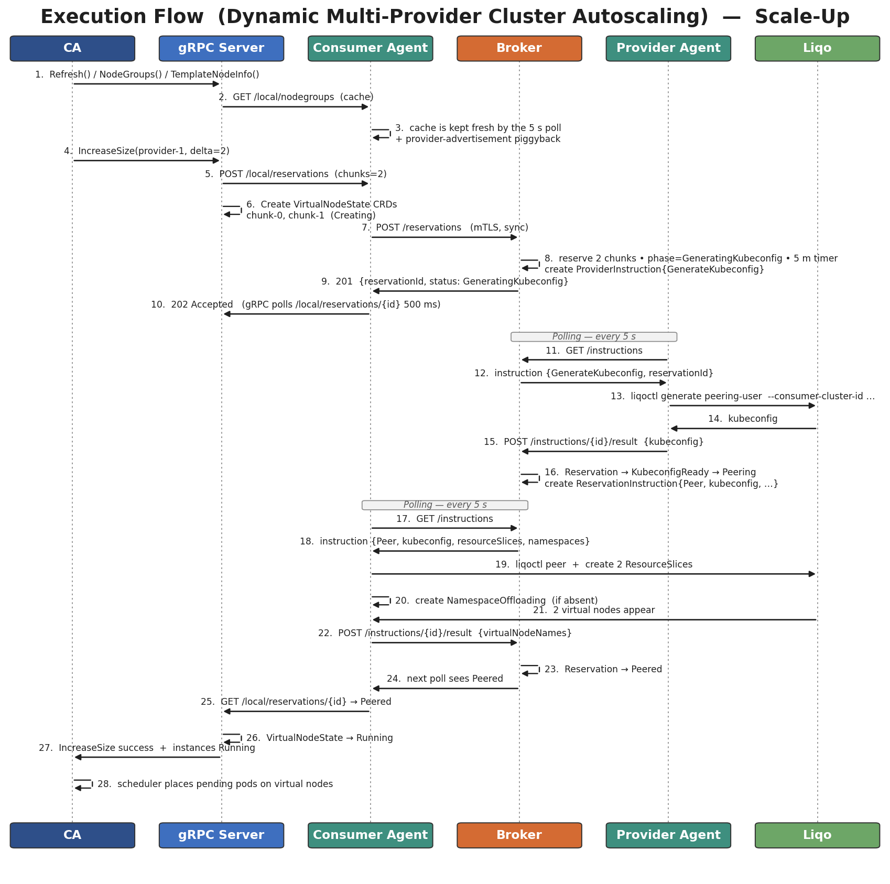
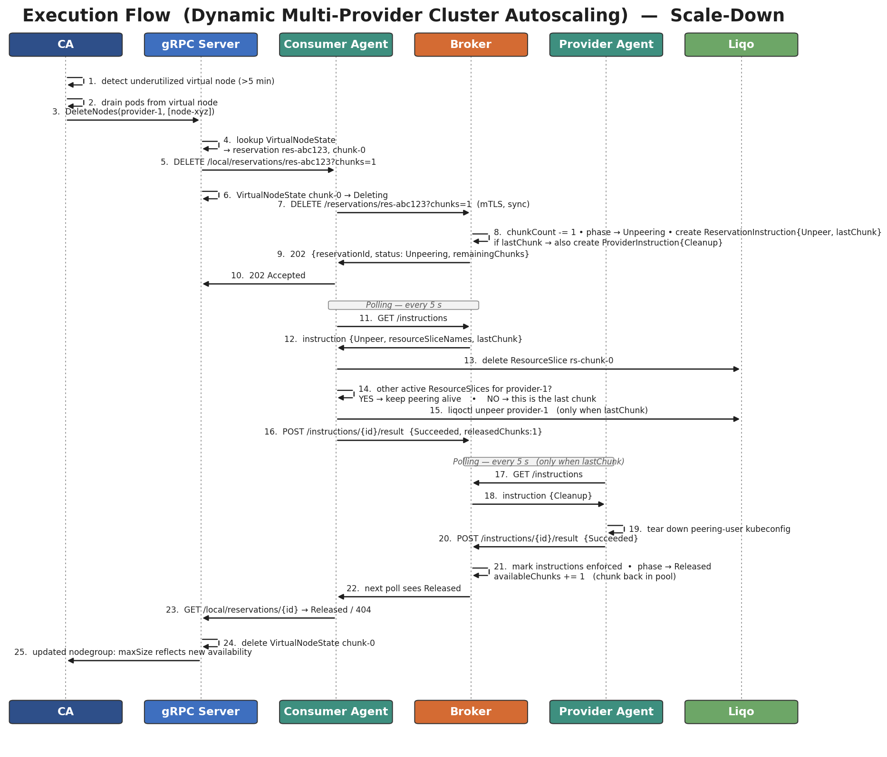

# Dynamic Multi-Provider Cluster Autoscaling for the Computing Continuum

## Architectural Proposal

**Version:** 3.0

**Date:** April 21, 2026

**Based on:** "Dynamic Multi-Provider Cluster Autoscaling For The Computing Continuum" (ACM SAC 2025)

**Integrates:** k8s-resource-brokering, Multi-Cluster-Autoscaler, Kubernetes Cluster Autoscaler, Liqo

---

## Table of Contents

1. [Problem Statement](#1-problem-statement)
2. [Goals and Non-Goals](#2-goals-and-non-goals)
3. [System Overview](#3-system-overview)
4. [Components](#4-components)
5. [Custom Resource Definitions (CRDs)](#5-custom-resource-definitions-crds)
6. [ConfigMap Definition](#6-configmap-definition)
7. [API Contracts](#7-api-contracts)
8. [Execution Flows](#8-execution-flows)
9. [Failure Handling and Reconciliation](#9-failure-handling-and-reconciliation)
10. [Security](#10-security)
11. [Integration Plan with Existing Projects](#11-integration-plan-with-existing-projects)

---

## 1. Problem Statement

A single Kubernetes Cluster Autoscaler (CA) instance supports exactly **one cloud provider** at a time. It cannot natively borrow compute capacity from multiple heterogeneous sources (AWS, Azure, bare-metal, edge clusters) simultaneously.

Organizations operating in the computing continuum — spanning cloud, edge, and on-premise — need a mechanism to:

- Dynamically borrow resources from multiple existing Kubernetes clusters across different providers
- Make intelligent placement decisions based on cost, latency, and resource availability
- Present borrowed remote resources as regular nodes to the consumer cluster's scheduler
- Scale down and release borrowed resources when no longer needed
- **Operate even when consumer and provider clusters are behind NAT, firewalls, or otherwise unreachable from the internet** — only the central Broker requires a publicly reachable endpoint

This proposal defines a complete architecture that achieves this by combining **Kubernetes Cluster Autoscaler** (unmodified, vanilla), a **custom gRPC Cloud Provider**, a **central Resource Broker**, per-cluster **Resource Agents**, and **Liqo** for multi-cluster networking and virtual node creation.

---

## 2. Goals and Non-Goals

### Goals

- **G1:** Enable a single consumer cluster to scale across multiple provider clusters from different infrastructure providers simultaneously
- **G2:** Use the Kubernetes Cluster Autoscaler without any modifications to its source code
- **G3:** Centralize resource decision-making in a broker that considers cost, availability, and consumer-specific priorities
- **G4:** Support both standard (CPU/memory) and GPU workloads
- **G5:** Use Liqo to establish multi-cluster peering and present remote resources as virtual nodes
- **G6:** Support multiple consumers sharing the same provider cluster through resource chunking
- **G7:** Handle failures gracefully with timeouts, heartbeats, and reconciliation loops
- **G8:** Provide a secure communication channel between all components using mTLS
- **G9:** **Agent-initiated communication only**: the Broker never opens a connection toward a consumer or provider cluster. Every byte that reaches an agent is the response body of an HTTP call the agent initiated. Consumers and providers therefore need only outbound egress to the Broker's URL.
- **G10:** The gRPC server never talks to the Broker directly — it delegates every cross-cluster interaction to its co-located Resource Agent over an in-cluster REST API.

### Non-Goals

- Provisioning new VMs or physical machines (only borrows from existing clusters)
- Modifying the Cluster Autoscaler source code
- Supporting a cluster that is simultaneously a consumer and a provider
- Real-time sub-second autoscaling (target: 15-30 second scale-up latency)
- Cost optimization engine (placeholder for future work; the decision engine interface is defined but the scoring algorithm is pluggable)
- Broker-initiated (push) delivery of any kind — explicitly out of scope

---

## 3. System Overview


The system consists of three deployment domains connected by a strict asymmetric communication model:

| Channel | Initiator | Style | Rationale |
| --- | --- | --- | --- |
| CA ↔ gRPC Server | CA | gRPC, in-cluster | upstream `externalgrpc.proto` contract |
| gRPC Server ↔ Local Agent | gRPC Server | REST, in-cluster, **push-synchronous** | fast, low-latency local loop |
| Agent ↔ Broker | **Agent only** | REST over mTLS, **polling + sync POSTs** | works from any NATed cluster with egress to the Broker |
| Broker → Agent | **never happens** | — | enables unreachable consumer/provider clusters |

### 3.1 Central Cluster

Hosts the **Resource Broker** — a stateless HTTP server in front of a set of CRDs (the source of truth for advertisements, reservations, chunk calculations, and pending instructions). Deployed as a Deployment with leader election. The Broker **never** initiates an outbound connection to an agent; instead, it exposes an HTTPS endpoint that agents call.

### 3.2 Consumer Cluster(s)

Each consumer cluster runs:
- **Cluster Autoscaler (CA)** — vanilla, using the `externalgrpc` cloud provider
- **gRPC Server** — implements the CA's external cloud provider contract (15 gRPC methods); knows only the local Agent and has no Broker credentials
- **Resource Agent** — the single point of contact with the Broker. Exposes a **local REST API** (consumed in-cluster by the gRPC server) and runs an **outbound-only mTLS client** that polls the Broker every 5 seconds and makes synchronous POST/DELETE calls. It never listens on any externally reachable port.
- **Liqo** — installed, provides the networking and virtual node infrastructure

### 3.3 Provider Cluster(s)

Each provider cluster runs:
- **Resource Agent** — collects local resource metrics, advertises available resources (CPU/memory/GPU, Liqo cluster ID, topology labels) every 30 seconds, and polls the Broker every 5 seconds for pending instructions (`generate-kubeconfig`, `cleanup`, `reconcile`). No listener is exposed outside the cluster.
- **Liqo** — installed, serves as the peering endpoint

---

## 4. Components

### 4.1 Resource Broker (Central Cluster)

**Source:** Extended from `k8s-resource-brokering`.

**Deployment:** Kubernetes Deployment with 2+ replicas and leader election via `coordination.k8s.io/v1` Lease (only the leader serves writes; followers are hot standby). The server itself is stateless — all durable state lives in CRDs.

**Responsibilities:**

| Responsibility | Description |
|---|---|
| Advertisement ingestion | Accepts `POST /api/v1/advertisements` (every 30 s) from provider agents; stores `ClusterAdvertisement` CRDs |
| Consumer registration (implicit) | Learns about consumers via `POST /api/v1/reservations` and `POST /api/v1/heartbeat`; identity comes from the mTLS client certificate CN |
| Chunk calculation | Divides each provider's total resources into equal-sized chunks using the `chunk-config` ConfigMap |
| Decision making | On `POST /api/v1/reservations`, runs the decision engine **synchronously** inline and returns the chosen provider + reservation ID in the response body |
| Reservation state machine | Manages `Reservation` CRD phases (`Pending` → `GeneratingKubeconfig` → `KubeconfigReady` → `Peering` → `Peered` → `Unpeering` → `Released` \| `Expired` \| `Failed`) |
| Instruction generation | On phase transitions, creates `ProviderInstruction` (for provider agents) and `ReservationInstruction` (for consumer agents) records, filtered per cluster on subsequent `GET /api/v1/instructions` polls |
| Instruction piggyback | The response of `POST /api/v1/advertisements` inlines any pending `ProviderInstruction` records for the calling provider, so typical-case instruction latency is bounded by the 30 s advertisement cadence rather than the 5 s poll — but the 5 s poll guarantees an upper bound |
| Result ingestion | Receives `POST /api/v1/instructions/{id}/result` from agents (kubeconfig for `GenerateKubeconfig`, virtual-node names for `Peer`, tunnel-dropped boolean for `Unpeer`). Marks the instruction `Enforced: true` so it is no longer returned by `GET /instructions`. For kubeconfig payloads the Broker stores the bytes inside the Consumer's pending `ReservationInstruction{Kind: Peer}` so the consumer receives it on its next poll. |
| Rate limiting | Per-cluster token bucket on `GET /api/v1/instructions` — 10 rps burst, 5 rps sustained. Overflow returns `429 TooManyRequests`; the agent's existing exponential backoff absorbs it. |
| Health monitoring | Tracks `lastSeen` on every cluster from advertisements (providers) and heartbeats (consumers). Declares a cluster `Unavailable` after 30 s with no update. |
| Reconcile on drift | On startup and on leader change, issues `ProviderInstruction/ReservationInstruction {Kind: Reconcile}` to every active cluster; agents reply with a full state snapshot via `POST /instructions/{id}/result` and the Broker adopts it. |
| Price/priority reporting | Returns per-provider cost values that the agent relays to the gRPC server and ultimately exposes via the CA's `PricingNodePrice` method (enabling the `price` Expander) |

---

### 4.2 gRPC Server (Consumer Cluster)

**Source:** Rebuilt from `Multi-Cluster-Autoscaler`, replacing in-memory state with CRD-based state and **agent-only** external communication.

**Deployment:** Kubernetes Deployment (single replica per consumer cluster, runs alongside CA).

**Important:** The gRPC server has **no Broker client** and **no Broker credentials**. All cross-cluster interaction is the Agent's responsibility; the gRPC server calls `http://<agent-service>:<port>/local/*`.

**Responsibilities:**

| Responsibility | Description |
|---|---|
| Implement 15 gRPC methods | Fulfills the `externalgrpc.proto` contract the CA expects |
| Query the local Agent on Refresh | On each `Refresh()` call, issues `GET /local/nodegroups`; the Agent serves from its local cache (fed by the 5 s poll + advertisement piggybacking) |
| Present node groups to CA | Returns one node group per provider cluster / chunk type, with `min=0` and `max=N` where N = available chunks |
| Build node templates | Constructs fake `v1.Node` objects with chunk-sized resources, Liqo labels, and Liqo taints for CA simulation |
| Handle IncreaseSize | Issues `POST /local/reservations`; Agent returns `202 Accepted` immediately with a `reservationId`. gRPC server then polls `GET /local/reservations/{id}` every 500 ms until `Peered` or CA's deadline. Creates `VirtualNodeState` CRD entries with status `Creating`. |
| Handle DeleteNodes | Issues `DELETE /local/reservations/{id}?chunks=M`; Agent returns `202`. Marks `VirtualNodeState` entries as `Deleting`. |
| Report pricing | Returns Agent-provided (ultimately Broker-provided) cost values via `PricingNodePrice` to enable the `price` Expander strategy |
| Cache Agent responses | Caches last known node-group list to serve stale data if the Agent is temporarily unreachable |

**gRPC Method Implementation Map:**

| gRPC Method | gRPC Server Behavior |
|---|---|
| `NodeGroups` | Returns cached list of node groups (one per provider × chunk type) from latest `Refresh()` |
| `NodeGroupForNode` | Looks up `VirtualNodeState` CRD by node's Liqo cluster ID label to find which group it belongs to |
| `NodeGroupTargetSize` | Returns count of `VirtualNodeState` entries for this group that are not in `Deleting` state |
| `NodeGroupIncreaseSize` | Issues `POST /local/reservations`; polls `GET /local/reservations/{id}` until activated or CA timeout; creates `VirtualNodeState` CRDs |
| `NodeGroupDeleteNodes` | For each node: finds the corresponding `VirtualNodeState`, issues `DELETE /local/reservations/{id}?chunks=1`, marks CRD as `Deleting` |
| `NodeGroupDecreaseTargetSize` | Cancels pending (not-yet-peered) reservations via the Agent's delete endpoint |
| `NodeGroupNodes` | Lists `VirtualNodeState` CRDs for this group, maps status to `InstanceState` (Creating/Running/Deleting) |
| `NodeGroupTemplateNodeInfo` | If `currentSize >= 1`: reads the actual virtual node's spec. If `currentSize == 0`: constructs a fake node using the Agent-provided chunk size, Liqo labels, and Liqo taint |
| `PricingNodePrice` | Returns the Agent-relayed (Broker-authoritative) cost value for this provider |
| `GPULabel` | Returns `"nvidia.com/gpu"` (standard GPU label) |
| `GetAvailableGPUTypes` | Returns GPU types from the Agent's cached node-group list |
| `Refresh` | Issues `GET /local/nodegroups`; refreshes `VirtualNodeState` statuses via `GET /local/reservations/{id}` for non-terminal reservations |
| `Cleanup` | No-op or cleanup local caches |
| `PricingPodPrice` | Returns `Unimplemented` (code 12) |
| `NodeGroupGetOptions` | Returns custom `MaxNodeProvisionDuration` (e.g., 5 minutes to account for peering latency) |

**Node Template Construction (for `NodeGroupTemplateNodeInfo` when `currentSize == 0`):**

```yaml
apiVersion: v1
kind: Node
metadata:
  name: virtual-{provider-cluster-id}-template
  labels:
    type: virtual-node
    liqo.io/remote-cluster-id: "{provider-liqo-cluster-id}"
    node.kubernetes.io/instance-type: "liqo-virtual"
    topology.kubernetes.io/zone: "{provider-zone}"        # from Broker (via Agent) if available
    topology.kubernetes.io/region: "{provider-region}"     # from Broker (via Agent) if available
spec:
  taints:
    - key: virtual-node.liqo.io/not-allowed
      effect: NoExecute
status:
  capacity:
    cpu: "2"              # = standard-cpu chunk size from ConfigMap
    memory: "4Gi"         # = standard-memory chunk size from ConfigMap
    nvidia.com/gpu: "0"   # 0 for standard, chunk gpu-count for GPU groups
    pods: "110"
  allocatable:
    cpu: "2"
    memory: "4Gi"
    nvidia.com/gpu: "0"
    pods: "110"
```

---

### 4.3 Resource Agent (Consumer and Provider Clusters)

**Source:** Extended from `k8s-resource-brokering`.

**Deployment:** Kubernetes Deployment, **`replicas: 1`, `strategy: Recreate`** (no HA, no leader election — identical to the upstream project). A crashed pod is replaced cleanly; two pods never poll concurrently.

**Network exposure:** **outbound only.** The Agent opens:
- a **cluster-local listener** on `:8080` (Service type `ClusterIP`) — consumer agents only, reachable only by the in-cluster gRPC server;
- an **outbound mTLS HTTP client** targeting the Broker URL.

No Ingress, LoadBalancer, NodePort, or public DNS is required.

**Local API Surface (consumer agents only, in-cluster only):**

| Method | Endpoint | Description |
|---|---|---|
| GET | `/local/health` | Liveness / readiness |
| GET | `/local/nodegroups` | Served from the Agent's in-memory cache (populated by the 5 s Broker poll + piggyback) |
| POST | `/local/reservations` | Returns `202 + reservationId` immediately; internally calls Broker's `POST /api/v1/reservations` synchronously |
| GET | `/local/reservations/{id}` | Returns the Agent's cached view of the reservation (phase, virtualNodeNames); refreshed from Broker on cache miss |
| DELETE | `/local/reservations/{id}?chunks=N` | Returns `202`; internally calls Broker's `DELETE /api/v1/reservations/{id}?chunks=N` synchronously |
| GET | `/local/reservations` | Debug / cache warm-up listing |

**Broker-Facing Client (outbound only, mTLS):**

Every agent runs one outbound HTTP client. The client:

1. Polls `GET /api/v1/instructions` every **5 seconds** (short-poll; same cadence and style as `k8s-resource-brokering`).
2. Sends synchronous `POST /api/v1/advertisements` every 30 s (provider agents) with the advertisement body; the response piggybacks any `ProviderInstruction` records ready for this cluster, reducing polling latency in the common case.
3. Sends synchronous `POST /api/v1/heartbeat` every 15 s (consumer agents only; providers use advertisements as heartbeat).
4. Sends synchronous `POST /api/v1/reservations` and `DELETE /api/v1/reservations/{id}` on demand from the `/local/*` surface.
5. Reports the outcome of each processed instruction via `POST /api/v1/instructions/{id}/result` (idempotent; retries on 5xx / network errors with exponential backoff 1 s → 16 s, max 3 attempts).

**Provider-Agent Responsibilities:**

| Responsibility | Description |
|---|---|
| Collect metrics | Reads local node resources (allocatable − used), GPU availability, topology labels (zone/region) |
| Advertise capacity | Every 30 s `POST /api/v1/advertisements` — also acts as heartbeat; response carries piggybacked instructions |
| Execute `GenerateKubeconfig` | On receipt of a `ProviderInstruction{Kind: GenerateKubeconfig}` (via poll or piggyback): runs `liqoctl generate peering-user --consumer-cluster-id <id>`; POSTs the resulting kubeconfig as payload of `POST /api/v1/instructions/{id}/result` |
| Execute `Cleanup` | On `ProviderInstruction{Kind: Cleanup}`: tears down provider-side artefacts (peering-user kubeconfig, associated state); reports result |
| Execute `Reconcile` | On `ProviderInstruction{Kind: Reconcile}`: gathers current live advertisement state and reservation state, returns it in `POST /instructions/{id}/result` |
| Idempotency cache | Keyed by `reservationId + instruction kind`, TTL = `idempotency-cache-ttl` (10 min). Duplicate instructions return the cached result instead of re-executing. |

**Consumer-Agent Responsibilities:**

| Responsibility | Description |
|---|---|
| Serve local API | Handle `/local/*` requests from the in-cluster gRPC server |
| Heartbeat | Every 15 s `POST /api/v1/heartbeat` |
| Forward reservations | Translate `/local/reservations` calls into Broker calls synchronously; maintain a local cache of results for the gRPC server |
| Execute `Peer` | On `ReservationInstruction{Kind: Peer}` (received with kubeconfig **inlined**): store the kubeconfig as a Secret on the consumer cluster, run `liqoctl peer` if not already peered with this provider, create N `ResourceSlice` CRDs (one per chunk), create the `NamespaceOffloading` CR, wait for Liqo to materialize the virtual nodes, then POST result with `virtualNodeNames` |
| Execute `Unpeer` | On `ReservationInstruction{Kind: Unpeer}`: delete the specified `ResourceSlice`s; if `lastChunk == true`, run full `liqoctl unpeer`; report result |
| Execute `Cleanup` / `Reconcile` | Symmetric to the provider variants |
| Idempotency cache | Same contract as provider side |
| Local cache population | Merge polling results + piggybacked instructions + synchronous responses into a single in-memory view served to the gRPC server |

---

### 4.4 Cluster Autoscaler (Consumer Cluster)

**Source:** Upstream Kubernetes Cluster Autoscaler, unmodified.

**Configuration:**
```
--cloud-provider=externalgrpc
--cloud-config=/etc/autoscaler/cloud-config
--expander=price
--scale-down-enabled=true
--scale-down-unneeded-time=5m
--max-node-provision-time=5m
--scan-interval=10s
```

**Cloud config file:**
```
[Global]
address=localhost:50051
```

**Key point:** The CA is completely unaware of Liqo, the Broker, the Agent, or multi-provider topology. It sees node groups and makes decisions using its standard algorithms. The gRPC server acts as the translation layer.

---

### 4.5 Liqo (Consumer and Provider Clusters)

**Source:** Upstream Liqo, unmodified.

**Role:** Provides multi-cluster networking, authentication, and virtual node infrastructure.

**Key resources used:**
- `ResourceSlice` — Created by the consumer agent to request specific resources from a peered provider. Each ResourceSlice represents one chunk.
- `VirtualNode` — Automatically created by Liqo when a ResourceSlice is accepted. This is what the CA sees as a regular node.
- `NamespaceOffloading` — Created by the consumer agent to enable pod scheduling on virtual nodes for specific namespaces.

**Peering mode:** On-demand — established only when the CA first requests scale-up on a given provider, torn down when the last chunk is released.

---

## 5. Custom Resource Definitions (CRDs)

All CRDs remain at `v1alpha1`; changes versus `k8s-resource-brokering` are **additive only** (new fields, no renames, no breaking type changes).

### 5.1 VirtualNodeState (Consumer Cluster, managed by gRPC server)

Tracks the lifecycle of each virtual-node chunk on the consumer cluster.

```yaml
apiVersion: autoscaling.federation.io/v1alpha1
kind: VirtualNodeState
metadata:
  name: provider1-chunk-0
  namespace: federation-system
  labels:
    federation.io/provider-cluster-id: "provider-1"
    federation.io/node-group-id: "ng-provider-1-standard"
    federation.io/chunk-type: "standard"
spec:
  providerClusterId:     "provider-1"
  providerLiqoClusterId: "liqo-provider-1-xxxx"
  nodeGroupId:           "ng-provider-1-standard"
  chunkIndex:            0
  reservationId:         "res-abc123"
  resources:
    cpu:            "2"
    memory:         "4Gi"
    nvidia.com/gpu: "0"
status:
  phase:              Creating    # Creating | Running | Deleting | Failed
  virtualNodeName:    ""          # populated when Liqo creates the virtual node
  resourceSliceName:  ""          # populated when agent creates the ResourceSlice
  lastTransitionTime: "2026-04-08T10:30:00Z"
  message:            ""
```

Phase transitions:
```
Creating → Running → Deleting → (deleted)
Creating → Failed → (cleaned up)
```

### 5.2 ClusterAdvertisement (Broker)

From `k8s-resource-brokering`, extended with Liqo and chunk fields. **No `agentEndpoint` field** — the Broker never dials the agent.

```yaml
apiVersion: brokering.federation.io/v1alpha1
kind: ClusterAdvertisement
metadata:
  name: provider-1
  namespace: federation-system
spec:
  clusterId:      "provider-1"
  liqoClusterId:  "liqo-provider-1-xxxx"
  clusterType:    "standard"          # standard | gpu
  resources:
    allocatable:
      cpu:            "8"
      memory:         "16Gi"
      nvidia.com/gpu: "0"
  topology:
    zone:   "eu-west-1a"
    region: "eu-west-1"
  price: 1.0                          # $/chunk-hour, advertised by provider, enforced by Broker
status:
  lastSeen:        "2026-04-08T10:30:00Z"
  available:       true               # false if heartbeat timeout exceeded
  totalChunks:     4
  reservedChunks:  1
  availableChunks: 3
```

### 5.3 Reservation (Broker)

From `k8s-resource-brokering`, extended with chunk tracking, Liqo IDs and new phases.

```yaml
apiVersion: brokering.federation.io/v1alpha1
kind: Reservation
metadata:
  name: res-abc123
  namespace: federation-system
spec:
  consumerClusterId:     "consumer-1"
  consumerLiqoClusterId: "liqo-consumer-1-xxxx"
  providerClusterId:     "provider-1"
  providerLiqoClusterId: "liqo-provider-1-xxxx"
  chunkCount:            1
  chunkType:             "standard"   # standard | gpu
  resources:
    cpu:            "2"
    memory:         "4Gi"
    nvidia.com/gpu: "0"
status:
  phase:     Pending      # Pending | GeneratingKubeconfig | KubeconfigReady | Peering | Peered | Unpeering | Released | Expired | Failed
  createdAt: "2026-04-08T10:30:00Z"
  expiresAt: "2026-04-08T10:35:00Z"   # createdAt + reservation-timeout
  virtualNodeNames:
    - "liqo-node-provider-1-0"
  message: ""
```

Phase transitions:
```
Pending → GeneratingKubeconfig → KubeconfigReady → Peering → Peered
Peered → Unpeering → Released
{Pending, GeneratingKubeconfig, KubeconfigReady, Peering} → Failed | Expired
```

### 5.4 ProviderInstruction (Provider Agent cluster)

From `k8s-resource-brokering`, extended with `kind` and chunk fields. Created by the Broker; polled by the provider agent via `GET /api/v1/instructions`.

```yaml
apiVersion: agent.federation.io/v1alpha1
kind: ProviderInstruction
metadata:
  name: inst-res-abc123-genkube
spec:
  reservationId:         "res-abc123"
  kind:                  "GenerateKubeconfig"  # GenerateKubeconfig | Cleanup | Reconcile
  consumerClusterId:     "consumer-1"
  consumerLiqoClusterId: "liqo-consumer-1-xxxx"
  chunkCount:            1
  lastChunk:             false
  expiresAt:             "2026-04-08T10:35:00Z"
status:
  enforced:       false
  lastUpdateTime: "2026-04-08T10:30:00Z"
```

### 5.5 ReservationInstruction (Consumer Agent cluster)

From `k8s-resource-brokering`, extended. Created by the Broker; polled by the consumer agent via `GET /api/v1/instructions`. `Peer` instructions carry the kubeconfig **inlined** in the JSON returned by the polling endpoint (never stored in etcd on the consumer side).

```yaml
apiVersion: agent.federation.io/v1alpha1
kind: ReservationInstruction
metadata:
  name: inst-res-abc123-peer
spec:
  reservationId:         "res-abc123"
  kind:                  "Peer"   # Peer | Unpeer | Cleanup | Reconcile
  providerClusterId:     "provider-1"
  providerLiqoClusterId: "liqo-provider-1-xxxx"
  resourceSliceNames:    []
  chunkCount:            1
  lastChunk:             false
  kubeconfigRef:         "secret-name-on-broker-cluster"  # internal; payload is inlined in the polling response
  expiresAt:             "2026-04-08T10:35:00Z"
status:
  delivered:      false
  lastUpdateTime: "2026-04-08T10:30:00Z"
```

---

## 6. ConfigMap Definition

Deployed on the **central cluster**, in the Broker's namespace. Agents do not read this ConfigMap — they learn the effective chunk size per reservation from the `Reservation` body they receive.

```yaml
apiVersion: v1
kind: ConfigMap
metadata:
  name: chunk-config
  namespace: federation-system
data:
  # Standard (non-GPU) chunk size
  standard-cpu: "2"
  standard-memory: "4Gi"

  # GPU chunk size
  gpu-cpu: "4"
  gpu-memory: "8Gi"
  gpu-count: "1"

  # Timeouts
  reservation-timeout: "5m"
  agent-heartbeat-timeout: "30s"

  # Polling + rate limiting
  agent-poll-interval: "5s"
  agent-heartbeat-interval: "15s"
  provider-advertisement-interval: "30s"
  instructions-rate-limit-burst: "10"
  instructions-rate-limit-sustained: "5"

  # Idempotency / retry
  idempotency-cache-ttl: "10m"
  agent-request-timeout: "30s"
  agent-request-retries: "3"
```

**Rules:**
- A provider is classified as **GPU** if it advertises `nvidia.com/gpu > 0`, otherwise **standard**
- For standard providers: `chunks = min(cpu / standard-cpu, memory / standard-memory)` (floor, discard leftover)
- For GPU providers: `chunks = min(cpu / gpu-cpu, memory / gpu-memory, gpu / gpu-count)` (floor, discard leftover)
- Timeouts are aligned: heartbeat timeout `30s` = 2 × heartbeat interval `15s`, giving one missed beat of tolerance
- `idempotency-cache-ttl` bounds the age of retriable instructions

---

## 7. API Contracts

This section defines **every** wire-level interface used in the system. Three surfaces exist (the former "Broker → Agent" surface has been removed — no such calls exist in this architecture):

| # | Surface | Transport | Initiator | Auth |
|---|---|---|---|---|
| 7.1 | gRPC Server ↔ Cluster Autoscaler | gRPC (HTTP/2) | CA | upstream TLS (in-cluster) |
| 7.2 | gRPC Server ↔ Local Agent | HTTP/REST (in-cluster) | gRPC Server | optional ServiceAccount token |
| 7.3 | Agent → Broker | HTTPS/REST (cross-cluster) | **Agent only** | mTLS |

### 7.0 Common Conventions

**API version.** REST endpoints are prefixed with `/api/v1/` (cross-cluster) or `/local/` (in-cluster). Breaking changes go to `/api/v2/`; the previous version is supported for one minor release.

**Content type.** `application/json; charset=utf-8` for both request and response bodies.

**Cluster identity.** The Broker extracts `clusterId` from the `CN=…` of the agent's mTLS client certificate. Payload fields like `clusterId` are informational and cross-checked against the cert; mismatch → `403 Forbidden`. Every agent's `clusterId` equals its Liqo cluster ID, so one identity is used throughout.

**Idempotency.** Every mutating call carries `X-Reservation-Id` (reservation-scoped calls) or `X-Request-Id` (other calls). The receiver caches the response for `idempotency-cache-ttl` (10 min) and replays it verbatim for any retry with the same ID.

**Correlation.** Clients SHOULD send `X-Request-Id: <uuid>`; servers echo it in the response and in their logs.

**Standard error response.**
```
HTTP/1.1 <4xx|5xx>
Content-Type: application/json

{
  "code":      "ReservationExpired",
  "message":   "Reservation res-abc123 expired at 2026-04-08T10:35:00Z",
  "details":   { "reservationId": "res-abc123", "expiredAt": "2026-04-08T10:35:00Z" },
  "requestId": "c1f0...-e4a2"
}
```

**Stable error codes:**

| HTTP | `code`                 | Meaning |
|------|------------------------|---------|
| 400  | `InvalidRequest`       | Malformed payload or missing required field |
| 401  | `Unauthenticated`      | mTLS cert invalid / SA token missing |
| 403  | `Forbidden`            | Cert does not authorize this clusterId |
| 404  | `NotFound`             | Reservation / NodeGroup / Consumer not found |
| 409  | `Conflict`             | Idempotency mismatch or reservation in an incompatible phase |
| 410  | `ReservationExpired`   | Reservation already expired (>5m) |
| 422  | `InsufficientCapacity` | Not enough free chunks on the requested provider |
| 429  | `TooManyRequests`      | Rate-limited |
| 500  | `InternalError`        | Unhandled server-side failure |
| 502  | `UpstreamError`        | A dependency (Liqo, Kubernetes API) failed |
| 503  | `ServiceUnavailable`   | Broker unavailable or leader election in flight |
| 504  | `Timeout`              | Single-call timeout exceeded |

**Timeouts & retries (agent is always the retrier; Broker never retries because it never initiates):**
- Agent → Broker call timeout: **30 s** per attempt, **3 attempts**, exponential backoff (1 s, 4 s, 16 s, ±20 % jitter).

---

### 7.1 gRPC Server ↔ Cluster Autoscaler

Defined by upstream `externalgrpc.proto`. The gRPC server implements all 15 methods listed in § 4.2 with no non-upstream extensions.

---

### 7.2 gRPC Server ↔ Local Agent  (REST, in-cluster)

Plain HTTP over a ClusterIP Service, e.g. `http://federation-agent.federation-system.svc.cluster.local:8080`. Optional `Authorization: Bearer <ServiceAccount token>`.

#### 7.2.1 `GET /local/health`
```
GET /local/health

Response 200:
{"status": "healthy", "brokerReachable": true, "lastPollAgoSeconds": 3, "uptimeSeconds": 12345}
```

#### 7.2.2 `GET /local/nodegroups`
Returns every node group (= one chunk template per provider × chunk type) the Agent has cached from its latest Broker sync.
```
GET /local/nodegroups

Response 200:
{
  "nodeGroups": [
    {
      "id":                    "ng-provider-1-standard",
      "providerClusterId":     "provider-1",
      "providerLiqoClusterId": "liqo-provider-1-xxxx",
      "type":                  "standard",
      "minSize":               0,
      "maxSize":               3,
      "currentReserved":       1,
      "chunkResources":        {"cpu": "2", "memory": "4Gi", "nvidia.com/gpu": "0"},
      "cost":                  1.0,
      "topology":              {"zone": "eu-west-1a", "region": "eu-west-1"},
      "labels":                {"liqo.io/remote-cluster-id": "liqo-provider-1-xxxx"},
      "taints":                [{"key": "virtual-node.liqo.io/not-allowed", "effect": "NoExecute"}]
    }
  ],
  "generation": 42,
  "servedAt":   "2026-04-08T10:30:00Z",
  "cacheAgeSeconds": 3
}
```

#### 7.2.3 `POST /local/reservations`
Agent replies `202 Accepted` immediately with a `reservationId`; the gRPC server then polls `GET /local/reservations/{id}` every 500 ms until `Peered` or CA's internal deadline. This keeps CA's default gRPC timeout (10 s) uncoupled from the Liqo peering latency.
```
POST /local/reservations
Headers: X-Reservation-Id: <client-generated uuid>
Body:
{
  "providerClusterId": "provider-1",
  "nodeGroupId":       "ng-provider-1-standard",
  "chunkCount":        2,
  "chunkType":         "standard",
  "namespaces":        ["default"]
}

Response 202:
{
  "reservationId": "res-abc123",
  "status":        "Pending",
  "expiresAt":     "2026-04-08T10:35:00Z"
}
```

#### 7.2.4 `GET /local/reservations/{id}`
```
GET /local/reservations/res-abc123

Response 200:
{
  "reservationId":    "res-abc123",
  "status":           "Peered",
  "virtualNodeNames": ["liqo-node-provider-1-0", "liqo-node-provider-1-1"],
  "chunkCount":       2,
  "createdAt":        "2026-04-08T10:30:00Z",
  "activatedAt":      "2026-04-08T10:31:12Z",
  "message":          ""
}
```

#### 7.2.5 `DELETE /local/reservations/{id}`
```
DELETE /local/reservations/res-abc123?chunks=1

Response 202:
{
  "reservationId":       "res-abc123",
  "status":              "Unpeering",
  "remainingChunkCount": 1
}
```
Omit `?chunks=` to release the whole reservation.

#### 7.2.6 `GET /local/reservations`
```
GET /local/reservations

Response 200:
{ "reservations": [ /* 7.2.4 objects */ ], "total": 3 }
```

---

### 7.3 Agent → Broker  (REST over mTLS, **agent-initiated only**)

Base URL: `https://broker.central.example.com:8443/api/v1`. Mutual TLS required; `clusterId` derived from certificate CN.

#### 7.3.1 `POST /api/v1/advertisements`   *(provider, every 30 s — doubles as heartbeat; response piggybacks instructions)*
```
POST /api/v1/advertisements
Body:
{
  "clusterId":     "provider-1",
  "liqoClusterId": "liqo-provider-1-xxxx",
  "resources":     {"cpu": "8", "memory": "16Gi", "nvidia.com/gpu": "0"},
  "topology":      {"zone": "eu-west-1a", "region": "eu-west-1"},
  "price":         1.0,
  "liqoLabels":    {"liqo.io/type": "virtual-node"},
  "liqoTaints":    [{"key": "virtual-node.liqo.io/not-allowed", "effect": "NoExecute"}]
}

Response 200:
{
  "accepted":      true,
  "chunkCount":    4,
  "chunkResources":{"cpu": "2", "memory": "4Gi"},
  "nextReportIn":  "30s",
  "instructions":  [ /* zero or more ProviderInstruction objects (see 7.3.6) */ ]
}
```

#### 7.3.2 `GET /api/v1/advertisements/{clusterId}`   *(provider)*
Returns the Broker's current view of this provider's advertisement, including `Reserved` chunks. Used by the agent to preserve the Broker-managed `Reserved` field across advertisement re-submissions (same protocol as upstream `k8s-resource-brokering`).

#### 7.3.3 `POST /api/v1/heartbeat`   *(consumer, every 15 s)*
```
POST /api/v1/heartbeat
Body: {"clusterId": "consumer-1", "liqoClusterId": "liqo-consumer-1-xxxx"}

Response 200: {"ackAt": "2026-04-08T10:30:00Z"}
```

#### 7.3.4 `GET /api/v1/nodegroups`   *(consumer)*
Returns every node group visible to this consumer. Same schema as § 7.2.2.

#### 7.3.5 `POST /api/v1/reservations`   *(consumer — synchronous decision)*
Broker runs the decision engine inline and returns the reservation record immediately. At this point `phase` is `Pending` or `GeneratingKubeconfig`; the peering step is handled asynchronously via polling (§ 7.3.6).
```
POST /api/v1/reservations
Headers: X-Reservation-Id: <uuid>
Body:
{
  "providerClusterId": "provider-1",
  "nodeGroupId":       "ng-provider-1-standard",
  "chunkCount":        2,
  "chunkType":         "standard",
  "namespaces":        ["default"]
}

Response 201:
{
  "reservationId":       "res-abc123",
  "status":              "GeneratingKubeconfig",
  "providerClusterId":   "provider-1",
  "providerLiqoClusterId":"liqo-provider-1-xxxx",
  "chunkCount":          2,
  "chunkType":           "standard",
  "resources":           {"cpu": "2", "memory": "4Gi"},
  "createdAt":           "2026-04-08T10:30:00Z",
  "expiresAt":           "2026-04-08T10:35:00Z"
}
```

#### 7.3.6 `GET /api/v1/instructions`   *(both agents, polled every 5 s)*
Returns the list of pending instructions for this cluster (derived from the CRDs owned by the Broker). Subject to per-cluster rate limiting (10 burst / 5 sustained rps).

Body for a **provider** call returns `ProviderInstruction` objects:
```
Response 200:
{
  "instructions": [
    {
      "id":                    "inst-res-abc123-genkube",
      "kind":                  "GenerateKubeconfig",
      "reservationId":         "res-abc123",
      "consumerClusterId":     "consumer-1",
      "consumerLiqoClusterId": "liqo-consumer-1-xxxx",
      "chunkCount":            2,
      "lastChunk":             false,
      "issuedAt":              "2026-04-08T10:30:02Z",
      "expiresAt":             "2026-04-08T10:35:00Z"
    }
  ]
}
```

Body for a **consumer** call returns `ReservationInstruction` objects, with the kubeconfig inlined for `Peer`:
```
Response 200:
{
  "instructions": [
    {
      "id":                     "inst-res-abc123-peer",
      "kind":                   "Peer",
      "reservationId":          "res-abc123",
      "providerClusterId":      "provider-1",
      "providerLiqoClusterId":  "liqo-provider-1-xxxx",
      "chunkCount":             2,
      "lastChunk":              false,
      "kubeconfig":             "<base64 PEM kubeconfig, inlined>",
      "resourceSliceResources": {"cpu": "2", "memory": "4Gi", "nvidia.com/gpu": "0"},
      "namespaces":             ["default"],
      "issuedAt":               "2026-04-08T10:30:14Z",
      "expiresAt":              "2026-04-08T10:35:00Z"
    }
  ]
}
```

Redelivery semantics: the Broker keeps returning an instruction while `status.enforced == false`. Only a matching `POST /instructions/{id}/result` clears it from subsequent polls. This is exactly the behaviour of upstream `k8s-resource-brokering`'s `GetInstructions` handler.

#### 7.3.7 `POST /api/v1/instructions/{id}/result`   *(both agents)*
Report the outcome of an instruction. Keeps large payloads (kubeconfig bytes, error messages) out of CRD `status` and out of etcd watch streams.

Provider, after running `liqoctl generate peering-user`:
```
POST /api/v1/instructions/inst-res-abc123-genkube/result
Headers: X-Reservation-Id: res-abc123
Body:
{
  "status":  "Succeeded",
  "payload": {
    "kind":       "KubeconfigPayload",
    "kubeconfig": "<base64 PEM>",
    "expiresAt":  "2026-04-08T11:30:00Z"
  }
}

Response 200: {"accepted": true}
```

Consumer, after `liqoctl peer` + ResourceSlice creation:
```
POST /api/v1/instructions/inst-res-abc123-peer/result
Headers: X-Reservation-Id: res-abc123
Body:
{
  "status":  "Succeeded",
  "payload": {
    "kind":               "PeerPayload",
    "virtualNodeNames":   ["liqo-node-provider-1-0", "liqo-node-provider-1-1"],
    "resourceSliceNames": ["rs-res-abc123-0", "rs-res-abc123-1"]
  }
}
```

Unpeer result:
```
POST /api/v1/instructions/inst-res-abc123-unpeer/result
Body:
{
  "status":  "Succeeded",
  "payload": {
    "kind":           "UnpeerPayload",
    "releasedChunks": 1,
    "tunnelDropped":  false
  }
}
```

Reconcile result (agent's authoritative view):
```
POST /api/v1/instructions/inst-reconcile-xyz/result
Body:
{
  "status":  "Succeeded",
  "payload": {
    "kind":              "ReconcilePayload",
    "advertisement":     { /* § 7.3.1 body, agent's current truth (provider only) */ },
    "virtualNodeStates": [ /* condensed view of local state */ ]
  }
}
```

Failure path:
```
Body:
{
  "status":  "Failed",
  "error":   {"code": "UpstreamError", "message": "liqoctl peer exited with status 1"}
}
```

#### 7.3.8 `GET /api/v1/reservations/{id}`   *(both agents)*
Same schema as § 7.2.4. Used by the consumer agent to populate its local cache when a gRPC-server call misses.

#### 7.3.9 `DELETE /api/v1/reservations/{id}`   *(consumer — full or partial release)*
```
DELETE /api/v1/reservations/res-abc123?chunks=1

Response 202:
{
  "reservationId":       "res-abc123",
  "status":              "Unpeering",
  "remainingChunkCount": 1
}
```

---

### 7.4 Summary of Endpoints

| Surface | Method & Path | Direction | Purpose |
|---|---|---|---|
| 7.1 | gRPC `externalgrpc.proto` (15 methods) | CA ↔ gRPC Server | CA cloud-provider contract |
| 7.2.1 | `GET  /local/health` | gRPC → Agent | liveness |
| 7.2.2 | `GET  /local/nodegroups` | gRPC → Agent | list node groups |
| 7.2.3 | `POST /local/reservations` | gRPC → Agent | reserve chunks (202) |
| 7.2.4 | `GET  /local/reservations/{id}` | gRPC → Agent | reservation status |
| 7.2.5 | `DELETE /local/reservations/{id}` | gRPC → Agent | release (full / partial) |
| 7.2.6 | `GET  /local/reservations` | gRPC → Agent | list reservations |
| 7.3.1 | `POST /api/v1/advertisements` | Provider Agent → Broker | advertise + heartbeat + piggyback |
| 7.3.2 | `GET  /api/v1/advertisements/{clusterId}` | Provider Agent → Broker | preserve `Reserved` field |
| 7.3.3 | `POST /api/v1/heartbeat` | Consumer Agent → Broker | 15 s liveness |
| 7.3.4 | `GET  /api/v1/nodegroups` | Consumer Agent → Broker | list node groups |
| 7.3.5 | `POST /api/v1/reservations` | Consumer Agent → Broker | synchronous decision |
| 7.3.6 | `GET  /api/v1/instructions` | Both Agents → Broker | poll pending instructions every 5 s |
| 7.3.7 | `POST /api/v1/instructions/{id}/result` | Both Agents → Broker | report outcome + payload |
| 7.3.8 | `GET  /api/v1/reservations/{id}` | Both Agents → Broker | reservation lookup |
| 7.3.9 | `DELETE /api/v1/reservations/{id}` | Consumer Agent → Broker | release |

---

## 8. Execution Flows

### 8.1 Registration Flow

```
PROVIDER CLUSTER                      CENTRAL CLUSTER
─────────────────                     ───────────────
Provider Agent                        Broker
     │                                   │
     │ POST /api/v1/advertisements       │
     │ { resources, liqoClusterId,       │
     │   topology, price }               │
     │──── mTLS ───────────────────────>│
     │                                   │── Calculate chunks
     │                                   │── Upsert ClusterAdvertisement
     │ 200 + {chunkCount, instructions: []} ── Update lastSeen
     │<──────────────────────────────────│
     │                                   │
     │ (repeats every 30 s)              │
     │ GET /api/v1/instructions (5 s)    │── returns [] until something is pending
     │<──────────────────────────────────│


CONSUMER CLUSTER                      CENTRAL CLUSTER
─────────────────                     ───────────────
Consumer Agent                        Broker
     │                                   │
     │ POST /api/v1/heartbeat (15 s)     │── Update lastSeen, create ConsumerRecord on first call
     │──── mTLS ───────────────────────>│
     │                                   │
     │ GET /api/v1/instructions (5 s)    │── returns [] until something is pending
     │<──────────────────────────────────│
```

The Broker never needs to dial either cluster.

### 8.2 Scale-Up Flow (Complete)



```
Step 1: CA detects unschedulable pods.
Step 2: CA calls Refresh() → gRPC server → Agent's /local/nodegroups (served from cache).
Step 3: CA calls NodeGroups() → [ng-provider-1-standard(min=0,max=3), ng-provider-2-gpu(min=0,max=2)].
Step 4: CA calls NodeGroupTemplateNodeInfo() → chunk-sized fake Node per group.
Step 5: CA simulates: "can my pending pods fit on a node from group X?"
Step 6: CA estimator: "how many nodes from group X do I need?"
Step 7: CA price Expander: picks the cheapest valid option.
Step 8: CA calls NodeGroupIncreaseSize(id="ng-provider-1-standard", delta=2).

→ gRPC Server:
  Step  9: POST http://agent:8080/local/reservations { provider-1, 2 chunks }.
  Step 10: Creates VirtualNodeState CRDs: chunk-0 (Creating), chunk-1 (Creating).

→ Consumer Agent:
  Step 11: POST https://broker.../api/v1/reservations (mTLS) — SYNCHRONOUS.

→ Broker:
  Step 12: Validates availability (3 ≥ 2) ✓.
  Step 13: Creates Reservation (phase=GeneratingKubeconfig, expiresAt=+5m).
  Step 14: Updates ClusterAdvertisement (reservedChunks += 2).
  Step 15: Creates a ProviderInstruction{Kind:GenerateKubeconfig} CRD targeted at provider-1.
  Step 16: Returns 201 { reservationId, status: "GeneratingKubeconfig", provider… } synchronously.

→ Consumer Agent:
  Step 17: Returns 202 { reservationId, status:"GeneratingKubeconfig" } to gRPC server (unblocks CA chain).

→ gRPC Server:
  Step 18: Starts polling GET /local/reservations/{id} every 500 ms (bounded by CA's MaxNodeProvisionDuration).

→ Provider Agent (next 5 s poll OR piggybacked in its next /advertisements response):
  Step 19: Receives ProviderInstruction{GenerateKubeconfig, consumer-1, consumerLiqoClusterId…}.
  Step 20: Runs `liqoctl generate peering-user --consumer-cluster-id liqo-consumer-1-xxxx`.
  Step 21: POST /api/v1/instructions/{id}/result {status:"Succeeded", payload:{kubeconfig}}.

→ Broker:
  Step 22: Marks the ProviderInstruction as Enforced:true (removed from future polls).
  Step 23: Stores kubeconfig bytes inside a new ReservationInstruction{Kind:Peer} targeted at consumer-1.
  Step 24: Reservation phase → KubeconfigReady → Peering.

→ Consumer Agent (next 5 s poll):
  Step 25: GET /api/v1/instructions returns ReservationInstruction{Peer, kubeconfig inlined, chunkCount=2…}.
  Step 26: Writes kubeconfig to a Secret on the consumer cluster.
  Step 27: If not already peered with provider-1 → runs `liqoctl peer`.
  Step 28: Creates ResourceSlice #1 and #2 (cpu=2, memory=4Gi each).
  Step 29: Creates NamespaceOffloading CR for the specified namespaces (if missing).
  Step 30: Waits for Liqo to materialize 2 VirtualNodes.
  Step 31: POST /api/v1/instructions/{id}/result {status:"Succeeded", payload:{virtualNodeNames, resourceSliceNames}}.

→ Broker:
  Step 32: Marks ReservationInstruction Enforced:true; Reservation phase → Peered; stores virtualNodeNames.

→ gRPC Server:
  Step 33: Its 500 ms poll now sees phase=Peered + virtualNodeNames → updates VirtualNodeState → Running.
  Step 34: Returns success to CA's NodeGroupIncreaseSize.

→ CA:
  Step 35: NodeGroupNodes() returns instances with InstanceRunning status.
  Step 36: Scheduler places pending pods on the new virtual nodes.
```

**Typical latency:** 15-30 s from step 1 to step 36. The two polling gaps (steps 19, 25) add ≤ 5 s each in the worst case and ≤ 0 s when advertisement-piggyback delivers the provider's instruction.

### 8.3 Scale-Down Flow (Complete)



```
Step 1: CA detects an underutilized virtual node for > 5 minutes.
Step 2: CA drains pods.
Step 3: CA calls NodeGroupDeleteNodes(id="ng-provider-1-standard", nodes=[node-xyz]).

→ gRPC Server:
  Step 4: Looks up VirtualNodeState for node-xyz → reservation res-abc123, chunk-0.
  Step 5: DELETE http://agent:8080/local/reservations/res-abc123?chunks=1.
  Step 6: Marks VirtualNodeState chunk-0 → Deleting.

→ Consumer Agent:
  Step 7: DELETE https://broker.../api/v1/reservations/res-abc123?chunks=1 (mTLS).

→ Broker:
  Step 8:  Reservation phase → Unpeering; Reservation.Spec.chunkCount -= 1.
  Step 9:  Creates a ReservationInstruction{Kind:Unpeer, resourceSliceNames:[rs-chunk-0], lastChunk:false} for consumer-1.
  Step 10: If this was the last chunk of this reservation → also creates ProviderInstruction{Kind:Cleanup, lastChunk:true} for provider-1.
  Step 11: Returns 202 to the consumer agent → consumer agent returns 202 to gRPC server.

→ Consumer Agent (next 5 s poll):
  Step 12: Receives ReservationInstruction{Unpeer, resourceSliceNames:[rs-chunk-0]}.
  Step 13: Deletes the ResourceSlice.
  Step 14: If lastChunk == true → runs `liqoctl unpeer`.
  Step 15: POST /instructions/{id}/result {status:"Succeeded", payload:{releasedChunks:1, tunnelDropped:<bool>}}.

→ Provider Agent (only if lastChunk == true, next 5 s poll):
  Step 16: Receives ProviderInstruction{Cleanup}; tears down the peering-user kubeconfig.
  Step 17: POST /instructions/{id}/result {status:"Succeeded"}.

→ Broker:
  Step 18: Reservation phase → Released; availableChunks += 1 (chunk returns to the pool for any consumer).

→ gRPC Server (next Refresh):
  Step 19: GET /local/reservations/res-abc123 → 404 or Released.
  Step 20: Deletes VirtualNodeState chunk-0; next NodeGroups() reflects the freed chunk in maxSize.
```

### 8.4 Reservation Timeout Flow

```
Broker creates Reservation at T=0 with expiresAt = T+5m.

Broker reconciliation loop (every 30 s):
  If now > reservation.expiresAt AND phase ∈ {Pending, GeneratingKubeconfig, KubeconfigReady, Peering}:
    → Phase → Expired.
    → Release chunks (reservedChunks -= N).
    → Delete any still-pending ProviderInstruction/ReservationInstruction for this reservation.

Agents learn about expiry passively:
  - Consumer Agent's next GET /instructions no longer sees the Peer instruction.
  - gRPC Server's next GET /local/reservations/{id} returns status=Expired → VirtualNodeState → Failed.
  - CA may retry on a different provider.
```

### 8.5 Provider Heartbeat Timeout Flow

```
Provider-1 last advertisement at T=0.
Broker agent-heartbeat-timeout = 30 s (one missed beat).

Broker reconciliation loop (every 30 s):
  If now - lastSeen > agent-heartbeat-timeout:
    → Mark ClusterAdvertisement.available = false.
    → Exclude provider-1 from /nodegroups and from new /reservations decisions.
    → Existing Active reservations are preserved (peering may still be healthy);
      if the peering actually dropped, Liqo itself will surface that locally and the consumer
      agent's reconcile loop will release the ResourceSlices.

When provider-1 agent returns:
  → Next advertisement updates lastSeen.
  → available = true.
  → Provider-1 re-appears in nodegroup responses.
```

### 8.6 Reconciliation / Drift Recovery

```
Triggers:
  - Broker pod restart or leader change.
  - Broker detects a mismatch between its CRD state and an agent-reported action
    (e.g., VirtualNode exists on consumer but no matching Reservation on Broker).

Steps:
  1. Broker creates a ProviderInstruction{Kind:Reconcile} or ReservationInstruction{Kind:Reconcile}
     for every affected cluster.
  2. On the next 5 s poll, the agent receives the reconcile instruction.
  3. Agent assembles its authoritative view (advertisement content, list of ResourceSlices /
     VirtualNodeStates, active peerings).
  4. Agent POSTs /instructions/{id}/result { payload: ReconcilePayload }.
  5. Broker diff-applies the snapshot to its CRDs (create missing Reservations, release orphans).
```

---

## 9. Failure Handling and Reconciliation

### 9.1 gRPC Server Reconciliation Loop (every 30 s)

| Check | Action |
|---|---|
| VirtualNodeState is `Running` but no matching Liqo virtual node exists | Mark as `Failed`, issue `DELETE /local/reservations/{id}` |
| VirtualNodeState is `Creating` for longer than `reservation-timeout` | Mark as `Failed` (Broker has already expired the reservation) |
| Virtual node exists but no matching VirtualNodeState | Log warning (manual creation suspected) |
| Agent unreachable | Serve cached node-group data, retry on next loop |

### 9.2 Consumer Agent Reconciliation Loop (every 60 s)

| Check | Action |
|---|---|
| ResourceSlice exists but corresponding VirtualNodeState is `Deleting` / `Failed` | Delete the ResourceSlice |
| Liqo peering is broken for a provider with active ResourceSlices | Emit event; next Broker Reconcile instruction will surface it |
| NamespaceOffloading missing for namespaces with active virtual nodes | Recreate NamespaceOffloading CR |
| Local cache older than 2 × poll interval | Force a fresh `GET /api/v1/nodegroups` |

### 9.3 Broker Reconciliation Loop (every 30 s)

| Check | Action |
|---|---|
| Reservation past `expiresAt` and not Peered | Mark `Expired`, release chunks, delete pending instructions |
| Provider agent not seen within `agent-heartbeat-timeout` | Mark `Unavailable`; hide from /nodegroups |
| Consumer agent not seen within `agent-heartbeat-timeout` | Flag; after 2 × timeout, create Cleanup ProviderInstructions on all providers peered with it |
| Orphan `ProviderInstruction` / `ReservationInstruction` (reservation gone) | Delete |
| Enforced instructions older than 24 h | GC |
| Terminal reservations older than 7 days | GC |

### 9.4 Idempotency Contract

- Every reservation-scoped call carries `X-Reservation-Id` in header + body; the agent refuses requests where they mismatch.
- Agents cache `POST /instructions/{id}/result` replies for `idempotency-cache-ttl` so a retried instruction execution reports the same result without re-running `liqoctl`.
- The Broker's `GET /instructions` handler returns the same instruction repeatedly while `status.enforced == false`; result submission is the only thing that clears it. Agents MUST treat every execution as idempotent (no-op on re-invocation).

### 9.5 Agent Crash Recovery

- `replicas: 1` with `strategy: Recreate`: Kubernetes replaces a crashed agent pod without two pods ever polling concurrently.
- The replacement pod polls `GET /instructions` on startup and re-receives any instruction that was in flight → re-executes idempotently.
- Agent-side caches are in-memory; a restart loses them, but Broker state is authoritative and the next poll re-populates.

### 9.6 Broker Leader Failover

- HTTP server is stateless; Lease-based leader election swaps the serving pod.
- Agents experience at most one request failure during swap, absorbed by their 3-attempt retry with backoff.
- On becoming leader, a pod issues `Reconcile` instructions to every known cluster to resynchronize state (§ 8.6).

---

## 10. Security

### 10.1 Communication Security

| Channel | Protocol | Auth |
|---|---|---|
| CA ↔ gRPC Server | gRPC, in-cluster | localhost / in-cluster mTLS |
| gRPC Server ↔ Local Agent | HTTP, in-cluster | ClusterIP Service; optional ServiceAccount token |
| Agent → Broker | HTTPS, cross-cluster, **agent-initiated only** | mTLS (agent = client) |

No inbound port is required on any agent cluster. Consumer and provider clusters need only outbound egress to the Broker URL.

### 10.2 Certificate Management

- **Broker:** server certificate for its `/api/v1/*` endpoints.
- **Each agent:** client certificate with `CN = <Liqo cluster ID>` used when calling the Broker. No server certificate is needed (no external listener).
- Certificates are issued by a federation CA (e.g. cert-manager `ClusterIssuer`) and delivered to the agent as a Kubernetes Secret at onboarding time. Recommended rotation: 90 days.

### 10.3 Authentication & Authorisation

- The Broker's mTLS middleware extracts `clusterId` from the client certificate CN. The agent cannot spoof another cluster's identity.
- Every endpoint verifies that `clusterId` in the payload (if present) matches the CN; mismatch → `403 Forbidden`.
- A provider cannot reserve resources (it only publishes advertisements); a consumer cannot publish advertisements. The handler selects the allowed set of operations from the cert's role attribute or namespace convention.

### 10.4 Kubeconfig Security

- The peering-user kubeconfig is **limited scope** — produced by `liqoctl generate peering-user`, it grants only the permissions Liqo needs.
- Flow: Provider Agent → Broker (via `/instructions/{id}/result`, mTLS) → stored in the Broker's pending `ReservationInstruction` → Consumer Agent (inlined in the `/instructions` polling response, mTLS) → stored as a Kubernetes Secret on the consumer cluster.
- The kubeconfig is *not* written to the Broker's etcd CRD `status` (which would show up in watch streams). It is stored on disk within the Broker pod's PVC-backed instruction blob, or held in memory and replayed from the provider's idempotency cache on agent restart.
- Agent-side idempotency caches hold the kubeconfig for `idempotency-cache-ttl` (10 min) to tolerate retries; it is cleared thereafter.

### 10.5 Replay Protection

- Every reservation-scoped call carries `X-Reservation-Id`; agents reject calls missing it.
- Agents refuse to execute a second instruction for a reservation that is already in a terminal state.
- Agents compare `reservationId` in the body against the header and the authenticated `clusterId`.

### 10.6 Rate Limiting

- Per-cluster token bucket on `GET /api/v1/instructions`: 10 rps burst, 5 rps sustained. Violations → `429 TooManyRequests`; the agent's backoff handles it.
- Per-cluster bucket on `POST /api/v1/reservations`: 2 rps (prevents reservation-spam DoS).

---

## 11. Integration Plan with Existing Projects

### 11.1 From k8s-resource-brokering (Broker + Agent)

**Reuse as-is:**
- REST API server with mTLS (server.go + middleware)
- Existing handlers: `PostAdvertisement`, `GetAdvertisement`, `PostReservation`, `GetInstructions`
- Agent HTTP client: `HTTPCommunicator` with exponential backoff (`doWithRetry`)
- `ClusterAdvertisement`, `Reservation`, `Advertisement`, `ProviderInstruction`, `ReservationInstruction` CRDs
- Decision engine interface and resource-locking utility
- mTLS cert loading + `ValidateClientCertificate` middleware

**Modify (additive only, `v1alpha1` stays):**
- `ClusterAdvertisement` — add `liqoClusterId`, `topology`, `clusterType`, `price`, chunk status (`totalChunks`, `reservedChunks`, `availableChunks`)
- `Reservation` — add `consumerLiqoClusterId`, `providerLiqoClusterId`, `chunkCount`, `chunkType`, `virtualNodeNames`; extend phase enum with `GeneratingKubeconfig | KubeconfigReady | Peering | Peered | Unpeering | Released`
- `ProviderInstruction` — add `kind` (`GenerateKubeconfig | Cleanup | Reconcile`), `consumerLiqoClusterId`, `chunkCount`, `lastChunk`
- `ReservationInstruction` — add `kind` (`Peer | Unpeer | Cleanup | Reconcile`), `providerLiqoClusterId`, `resourceSliceNames`, `chunkCount`, `lastChunk`, in-response kubeconfig field (not stored in status)
- Broker — add chunk-calculation logic driven by the `chunk-config` ConfigMap
- Broker — extend `PostAdvertisement` response to piggyback pending `ProviderInstruction` records
- Broker — add `POST /api/v1/instructions/{id}/result` endpoint
- Broker — add `POST /api/v1/heartbeat` endpoint
- Broker — add rate limiting middleware (10/5 rps per cluster on /instructions, 2 rps on /reservations)
- Broker — extend decision engine to consider per-consumer priority and chunk availability
- Agent — add `/local/*` HTTP listener (consumer agents only)
- Agent — add instruction executors: `GenerateKubeconfig`, `Peer`, `Unpeer`, `Cleanup`, `Reconcile`
- Agent — add ResourceSlice, NamespaceOffloading, and `liqoctl` execution capability
- Agent — add idempotency cache keyed by `reservationId + instruction kind`
- Agent — differentiate behavior by role (consumer vs provider) from a CLI flag

**Remove:**
- Any Broker-initiated outbound client (if present) — not used
- Any polling-result cleanup path that used 202-followed-by-callback — replaced by in-line `GET /instructions` + `POST /result`
- Cost optimisation placeholder (replaced by chunk-based cost/priority scoring)

### 11.2 From Multi-Cluster-Autoscaler (gRPC Server)

**Reuse as-is:**
- Proto file contract (15 methods defined in `externalgrpc.proto`)
- gRPC server scaffolding and method signatures
- General Liqo-virtual-node concept

**Modify:**
- Replace all in-memory state with `VirtualNodeState` CRD
- Replace Discovery Server with agent-mediated node-group discovery (`GET /local/nodegroups`)
- Replace Node Manager's direct Liqo calls with agent-mediated flow (`POST/DELETE /local/reservations`)
- Add local HTTP client to the Agent (no Broker client, no Broker credentials)
- Add local caching of Agent responses (serve stale data when Agent is temporarily unreachable)
- Add reconciliation loop (VirtualNodeState ↔ actual Liqo virtual nodes)
- Add 500 ms polling of `GET /local/reservations/{id}` bounded by CA's `MaxNodeProvisionDuration`
- Add proper error handling (no `log.Fatalf`)

**Remove:**
- Discovery Server (replaced by Broker's provider knowledge, relayed via Agent)
- Node Manager (responsibilities split: gRPC server manages state, Agent executes Liqo)
- In-memory node/group maps (replaced by CRDs)
- Direct `liqoctl` subprocess calls (moved to Agent)
- Hardcoded values (replaced by ConfigMap on Broker, relayed via Agent)
- Any direct Broker client code

---

## Summary

This architecture achieves multi-provider cluster autoscaling on top of an **unmodified** Kubernetes Cluster Autoscaler, organised around two principles:

1. **Agent-only outbound communication with the Broker.** Every cross-cluster byte is the response body of a request an agent initiated. Consumer and provider clusters can therefore sit behind NAT or firewalls and still participate, as long as they can reach the Broker's URL.
2. **Agent-centric design on the consumer side.** The gRPC server talks only to its co-located Agent over an in-cluster REST API. The Agent is the single point of contact with the Broker and the single executor of `liqoctl` commands.

The Broker runs a `k8s-resource-brokering`-aligned REST API: providers `POST /advertisements` every 30 s (response piggybacks pending instructions), consumers `POST /reservations` synchronously (decision is returned inline) and `POST /heartbeat` every 15 s, and both agents `GET /instructions` every 5 s to pick up any pending work. Results (including the peering kubeconfig, which is inlined in `/instructions` responses but never stored in CRD status) flow back through `POST /instructions/{id}/result`. Chunking divides each provider's capacity into fixed units that become Liqo `ResourceSlice`s and ultimately virtual nodes that CA sees as ordinary pool members. The price Expander lets CA respect Broker-assigned priorities. All cross-cluster traffic is mTLS, and every reservation-scoped call carries an idempotency key so that retries never cause double-execution.
